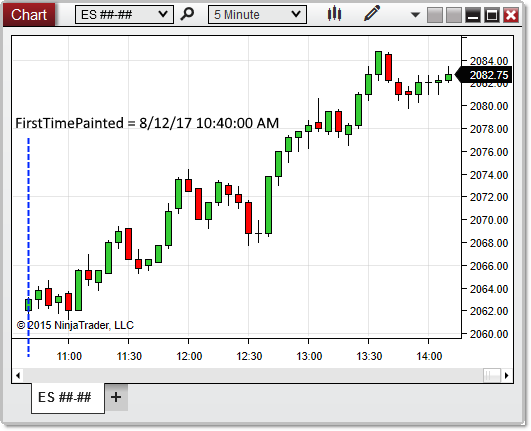

NinjaScript > Language Reference > Common > Charts > ChartControl > FirstTimePainted
FirstTimePainted
| << [Click to Display Table of Contents](firsttimepainted.md) >> **Navigation:**     [NinjaScript](ninjascript.md) > [Language Reference](language_reference_wip.md) > [Common](common.md) > [Charts](chart.md) > [ChartControl](chartcontrol.md) > FirstTimePainted | [Previous page](crosshairtype.md) [Return to chapter overview](chartcontrol.md) [Next page](chartcontrol_getbarpaintwidth.md) |
| --- | --- |
## Definition
Indicates a DateTime value of the first bar painted on the chart. 
 
FirstTimePainted provides the timestamp of the first bar, NOT the time at which the bar was painted. For example, if a chart was opened and historical bars drawn on August 2nd at 5:00 pm, but the first bar on the chart is painted at a time-axis value of July 31st at 1:00 am, then FirstTimePainted will return the July 31st date and time.
## 
## Property Value
A [DateTime](https://msdn.microsoft.com/en-us/library/system.datetime(v=vs.110).aspx) object containing information on the timestamp of the first bar of the chart.
## 
## Syntax
<ChartControl>.FirstTimePainted
## 
## Examples
| ns |
| --- |
| protected override void OnRender(ChartControl chartControl, ChartScale chartScale) {    // Draw text to display the first timestamp of a bar on the chart    Draw.Text(this, "firstTimeText", String.Format("The first bar of {0} is drawn at {1}", Instrument.MasterInstrument.Name, chartControl.FirstTimePainted), 1, High[0],Brushes.Black); } |

In the image below, FirstTimePainted reveals that the first painted slot corresponds to 8/12/17 at 10:40:00 AM.
 

