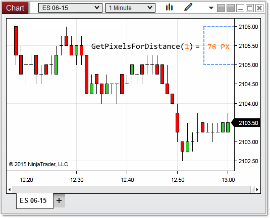



NinjaScript \> Language Reference \> Common \> Charts \> ChartScale \> GetPixelsForDistance()

GetPixelsForDistance()

| \<\< [Click to Display Table of Contents](getpixelsfordistance.md) \>\> **Navigation:**     [NinjaScript](ninjascript.md) \> [Language Reference](language_reference_wip.md) \> [Common](common.md) \> [Charts](chart.md) \> [ChartScale](chartscale.md) \> GetPixelsForDistance() | [Previous page](chartscale.md) [Return to chapter overview](chartscale.md) [Next page](getvaluebyy.md) |
| --- | --- |

## Definition

Returns the number of device pixels between the value passed to the method representing a series point value on the chart scale. 

 

## Method Return Value

A float representing the number of pixels between a value.

## 

## Syntax
\<chartScale\>.GetPixelsForDistance(double distance)

## 

## Method Parameters

| distance | A double value representing the distance in points to be measured |
| --- | --- |

## 

## Examples

| ns |
| --- |
| protected override void OnRender(ChartControl chartControl, ChartScale chartScale) {          // the number of pixels between the point value passed as a distance to the method    float   pixelForDistance \= chartScale.GetPixelsForDistance(0\.25);      Print("pixelForDistance: " \+ pixelForDistance); //20 pixels per every 1 tick on the chart scale } |

 

 

In the image below, we pass a value of 1 for the distance, which tells us there are 76 pixels for every 1 point on the ES 06\-15 chart scale.

 

