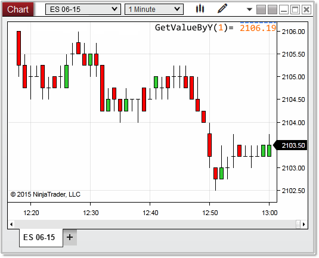


NinjaScript > Language Reference > Common > Charts > ChartScale > GetValueByY()
GetValueByY()

| << [Click to Display Table of Contents](getvaluebyy.md) >> **Navigation:**     [NinjaScript](ninjascript-1.md) > [Language Reference](language_reference_wip-1.md) > [Common](common-1.md) > [Charts](chart-1.md) > [ChartScale](chartscale-1.md) > GetValueByY() | [Previous page](getpixelsfordistance-1.md) [Return to chapter overview](chartscale-1.md) [Next page](getvaluebyywpf-1.md) |
| --- | --- |

## Definition
Returns the series value on the chart scale determined by a y pixel coordinate on the chart.
 
## Method Return Value
A double value representing a series value on the chart scale.  This is normally a price value, but can represent indicator plot values as well.
## 
## Syntax
<chartScale>.GetValueByY(float y)
## 
## Method Parameters
| y | A float value representing a pixel coordinate on the chart scale |
| --- | --- |

 
## 
## Examples
| ns |
| --- |
| protected override void OnRender(ChartControl chartControl, ChartScale chartScale) {    // the price value of the pixel coordinate passed in the method    double valueByY =   chartScale.GetValueByY(1);      Print("valueByY: " + valueByY); //2106.19693333    } |

In the image below, we pass a value of 1 for the y value, which tells us the pixel coordinate of 1 is located at a price of 2106.19 on the chart scale
 

