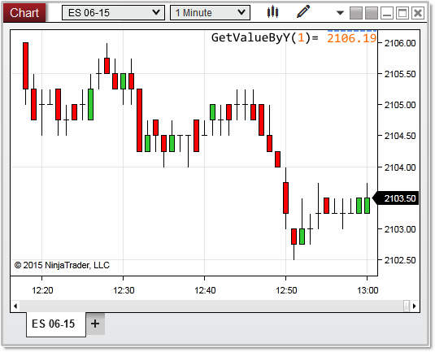



GetValueByY()

|  |  |
| --- | --- |
| << [Click to Display Table of Contents](.\getvaluebyy.htm) >>  **Navigation:**  [NinjaScript](ninjascript-1.htm) > [Language Reference](language_reference_wip-1.htm) > [Common](common-1.htm) > [Charts](chart-1.htm) > [ChartScale](chartscale-1.htm) >  GetValueByY() | [Previous page](getpixelsfordistance-1.htm) [Return to chapter overview](chartscale-1.htm) [Next page](getvaluebyywpf-1.htm) |

Definition
----------

Returns the series value on the chart scale determined by a y pixel coordinate on the chart.

Method Return Value
-------------------

A double value representing a series value on the chart scale.  This is normally a price value, but can represent indicator plot values as well.

Syntax 
<chartScale>.GetValueByY(float y)
-----------------------------------------

Method Parameters
-----------------

|  |  |
| --- | --- |
| y | A float value representing a pixel coordinate on the chart scale |

Examples
--------

| ns |
| --- |
| protected override void OnRender(ChartControl chartControl, ChartScale chartScale)  {     // the price value of the pixel coordinate passed in the method     double valueByY =   chartScale.GetValueByY(1);        Print("valueByY: " + valueByY); //2106.19693333     } |

 

 

In the image below, we pass a value of 1 for the y value, which tells us the pixel coordinate of 1 is located at a price of 2106.19 on the chart scale

