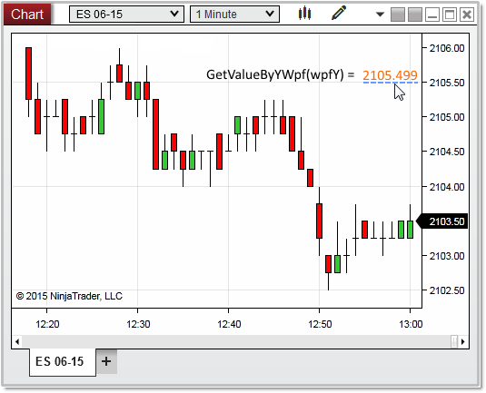


NinjaScript \> Language Reference \> Common \> Charts \> ChartScale \> GetValueByYWpf()
GetValueByYWpf()

| \<\< [Click to Display Table of Contents](getvaluebyywpf.md) \>\> **Navigation:**     [NinjaScript](ninjascript-1.md) \> [Language Reference](language_reference_wip-1.md) \> [Common](common-1.md) \> [Charts](chart-1.md) \> [ChartScale](chartscale-1.md) \> GetValueByYWpf() | [Previous page](getvaluebyy-1.md) [Return to chapter overview](chartscale-1.md) [Next page](getybyvalue-1.md) |
| --- | --- |

## Definition
Returns the series value on the chart scale determined by a WPF coordinate on the chart.  
 
## Method Return Value
A double value representing a series value on the chart scale.  This is normally a price value, but can represent indicator plot values as well.
 
## Syntax
\<chartScale\>.GetValueByYWpf(double y)
## 
## Method Parameters
| y | A double value representing a WPF coordinate on the chart scale |
| --- | --- |

## 
## 
## Examples
| ns |
| --- |
| protected override void OnRender(ChartControl chartControl, ChartScale chartScale) {    // store the y location the user clicked    double   wpfY \= chartControl.MouseDownPoint.Y;      // gets price value of the WPF coordinate passed to the method    double   valueByYWpf \= chartScale.GetValueByYWpf(wpfY);      Print("valueByYWpf: " \+ valueByYWpf); //2105\.49995215 } |

In the image below, we used the Chart Control property [MouseDownPoint](mousedownpoint-1.md) as the "wpfy" variable, which in return tells us the user clicked on a Y value of 2105\.499 on the chart scale.
 

