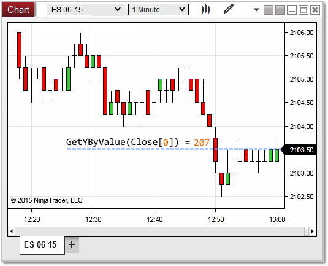


NinjaScript > Language Reference > Common > Charts > ChartScale > GetYByValue()
GetYByValue()
| << [Click to Display Table of Contents](getybyvalue.md) >> **Navigation:**     [NinjaScript](ninjascript-1.md) > [Language Reference](language_reference_wip-1.md) > [Common](common-1.md) > [Charts](chart-1.md) > [ChartScale](chartscale-1.md) > GetYByValue() | [Previous page](getvaluebyywpf-1.md) [Return to chapter overview](chartscale-1.md) [Next page](getybyvaluewpf-1.md) |
| --- | --- |
## Definition
Returns the chart's y-pixel coordinate on the chart determined by a series value represented on the chart scale.
 
## Method Return Value
An int value representing a y pixel coordinate on the chart scale.
## 
## Syntax
<chartScale>.GetYByValue(double val)
## 
## Method Parameters
| val | A double value which usually represents a price or indicator value |
| --- | --- |

 
## 
## Examples
| ns |
| --- |
| protected override void OnRender(ChartControl chartControl, ChartScale chartScale) {    // gets the pixel coordinate of the price value passed to the method    int     yByValue = chartScale.GetYByValue(Bars.GetClose(Bars.Count - 1));      Print("yByValue: " + yByValue); // 207 } |

 In the image below, we pass the last bar close as the value (example logic avoids using a bars ago index, see also [OnRender()](onrender-1.md) note #5), which in return tells us the last price displayed on the chart is at a y location of 207 pixels.
 

