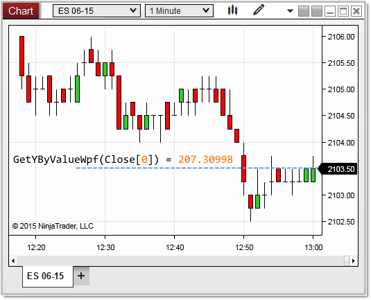


NinjaScript > Language Reference > Common > Charts > ChartScale > GetYByValueWpf()
GetYByValueWpf()
| << [Click to Display Table of Contents](getybyvaluewpf.md) >> **Navigation:**     [NinjaScript](ninjascript-1.md) > [Language Reference](language_reference_wip-1.md) > [Common](common-1.md) > [Charts](chart-1.md) > [ChartScale](chartscale-1.md) > GetYByValueWpf() | [Previous page](getybyvalue-1.md) [Return to chapter overview](chartscale-1.md) [Next page](height-1.md) |
| --- | --- |
## Definition
Returns a WPF coordinate on the chart determined by a series value represented on the chart scale.
 
## Method Return Value
An double value representing a WPF coordinate on the chart scale
## 
## Syntax
<chartScale>.GetYByValueWpf(double val)
## 
## Method Parameters
| val | A double value which usually represents a price or indicator value |
| --- | --- |

## 
## 
## Examples
| ns |
| --- |
| protected override void OnRender(ChartControl chartControl, ChartScale chartScale) {    // gets the wpf coordinate of the price value passed to the method    int     valueByYWpf = chartScale.GetYByValueWpf(Bars.GetClose(Bars.Count - 1));      Print("valueByYWpf: " + valueByYWpf); // 207 } |

 In the image below, we pass the last bar close as the value (example logic avoids using a bars ago index, see also [OnRender()](onrender-1.md) note #5), which in return tells us the last price displayed on the chart is at a WPF location of 207.30998 pixels.
 

