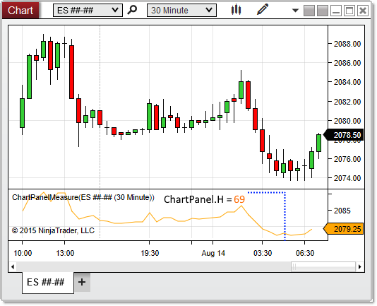

NinjaScript \> Language Reference \> Common \> Charts \> ChartPanel \> H (Height)
H (Height)
| \<\< [Click to Display Table of Contents](h_height_chartpanel.md) \>\> **Navigation:**     [NinjaScript](ninjascript.md) \> [Language Reference](language_reference_wip.md) \> [Common](common.md) \> [Charts](chart.md) \> [ChartPanel](chartpanel.md) \> H (Height) | [Previous page](chartobjects.md) [Return to chapter overview](chartpanel.md) [Next page](isyacisdisplayedleft_chartpanel.md) |
| --- | --- |
## Definition
Indicates the height (in pixels) of the rendered area of the chart panel. 
 
| Note:  The paintable area does not extend all the way to the top edge of the panel itself, as seen in the image below. |
| --- |

## Property Value
A int representing the height of the panel in pixels
 
## Syntax
ChartPanel.H
## 
## Example
| ns |
| --- |
| protected override void OnRender(ChartControl chartControl, ChartScale chartScale) {    base.OnRender(chartControl, chartScale);         // Print the height of the panel    Print(ChartPanel.H); } |

Based on the image below, H reveals that the paintable area of the chart panel is 69 pixels high.
 

