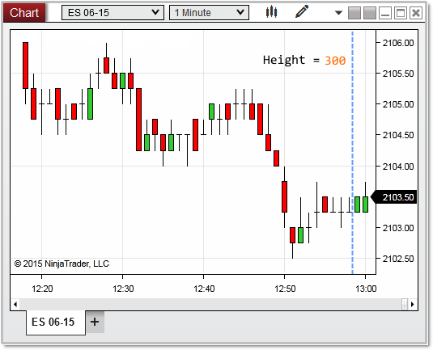

NinjaScript > Language Reference > Common > Charts > ChartScale > Height
Height
| << [Click to Display Table of Contents](height.md) >> **Navigation:**     [NinjaScript](ninjascript.md) > [Language Reference](language_reference_wip.md) > [Common](common.md) > [Charts](chart.md) > [ChartScale](chartscale.md) > Height | [Previous page](getybyvaluewpf.md) [Return to chapter overview](chartscale.md) [Next page](chartscale_isvisible.md) |
| --- | --- |
## Definition
Indicates the overall distance (from top to bottom) of the chart scale.
 
| Note: Height does not return its value in terms of device pixels. However, using Height.ConvertToVerticalPixels or Height.ConvertToHorizontalPixels will convert the Height value to device pixels. Alternatively, RenderTarget.PixelSize.Height or ChartPanel.H will also provide the height in terms of device pixels. |
| --- |
## 
## 
## Property Value
A double value representing the height of the chart scale.
 
## Syntax
<chartScale>.Height
 
## Examples
| ns |
| --- |
| protected override void OnRender(ChartControl chartControl, ChartScale chartScale) {    // the height of the entire chart scale    double   height       = chartScale.Height;    Print("the height of the chart scale is: " + height);   } |
## 
## 
## In the image below, the entire of height of the chart scale is represented by the blue line which is calculated at 300 pixels.
 

