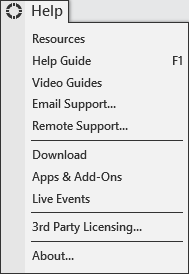


Operations \> Control Center \> Help Menu
Help Menu
| \<\< [Click to Display Table of Contents](help_menu.md) \>\> **Navigation:**     [Operations](operations.md) \> [Control Center](control_center.md) \> Help Menu | [Previous page](connections_menu.md) [Return to chapter overview](control_center.md) [Next page](orders_tab.md) |
| --- | --- |
The following menus and items are available via the Help menu of the NinjaTrader Control Center.
 

 
| Resources | Opens the NinjaTrader Support web page |
| --- | --- |
| Help Guide | Opens the application help guide (or press F1\) |
| Video Guides | Opens the New User Video Guides web page |
| Email Support... | Sends email support request |
| Remote Support... | Starts the NinjaTrader Support remote connection (only use this when instructed to do so by the support team) |
| Download | Download the latest version of NinjaTrader |
| Apps \& Add\-Ons | Takes you to the NinjaTrader Ecosystem web page |
| Live Events | Takes you to the live Events web page |
| 3rd party licensing | Verification for 3rd party add on products |
| About... | About NinjaTrader |
 
## 

