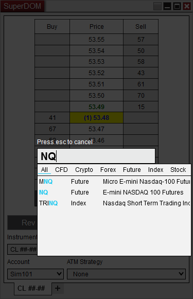

Operations \> Windows \> Using the Overlay Instrument Selector

Using the Overlay Instrument Selector

| \<\< [Click to Display Table of Contents](instrument_overlay_selector.md) \>\> **Navigation:**     [Operations](operations-1.md) \> [Windows](window_tabs-1.md) \> Using the Overlay Instrument Selector | [Previous page](usingtheinstrumentselector-1.md) [Return to chapter overview](window_tabs-1.md) [Next page](using_tabs-1.md) |
| --- | --- |
[Charts](charts-1.md), [Level II](level_ii-1.md), [Order entry windows](order_entry-1.md), [Time and Sales](time__sales-1.md), [Instrument Lists](instrument_lists-1.md), and [Market Analyzer](market_analyzer-1.md) windows all have the ability to begin typing in the window to display the Instrument Overlay Selector. 
 
## Using the overlay instrument selector
The overlay instrument selector is a quick way to change or select an instrument. 
 
- To access the Overlay Instrument Selector with the window selected and in focus begin typing on the keyboard the symbol of the instrument you wish to select. In the below image you can see the Overlay Instrument Selector over the top of the superDOM window.

- Once the symbol is typed in press "Enter" to complete the instrument selection or you can select the instrument from the Quick Search results. See the [Using the Instrument Selector](usingtheinstrumentselector-1.md) section for more information on the Quick Search.

- Press the "Esc" key on your keyboard to cancel.

 

 
## Shortcuts available in the Overlay Instrument Selector
Using these shortcuts you can quickly add an additional instrument or switch instruments. 
 
- Typing in a "\+" at the start of the Instrument Symbol or Time Frame will tell NinjaTrader to add an additional instrument to the current tab if the window supports that. 

- Typing in a "\+\+" on any tab will open a new tab with that instrument selected.
