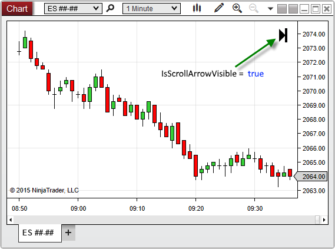


NinjaScript \> Language Reference \> Common \> Charts \> ChartControl \> IsScrollArrowVisible

IsScrollArrowVisible

| \<\< [Click to Display Table of Contents](isscrollarrowvisible.md) \>\> **Navigation:**     [NinjaScript](ninjascript.md) \> [Language Reference](language_reference_wip.md) \> [Common](common.md) \> [Charts](chart.md) \> [ChartControl](chartcontrol.md) \> IsScrollArrowVisible | [Previous page](chartcontrol_indicators.md) [Return to chapter overview](chartcontrol.md) [Next page](isstayindrawmode.md) |
| --- | --- |
## Definition
Indicates the time\-axis scroll arrow is visible in the top\-right corner of the chart.
## 
## Property Value
A bool value. When True, indicates that the scroll arrow is visible on the chart; otherwise False.
## 
## Syntax
\<ChartControl\>.IsScrollArrowVisible
## 
## Examples

| ns |
| --- |
| protected override void OnRender(ChartControl chartControl, ChartScale chartScale) {    // Print a message if the scroll arrow is visible on the chart    if(chartControl.IsScrollArrowVisible);        Print("The chart is currently not set to auto\-scroll. Click the scroll arrow to return to auto\-scrolling"); } |

Based on the image below, IsScrollArrowVisible confirms that the scroll arrow is currently visible on the chart.
 

