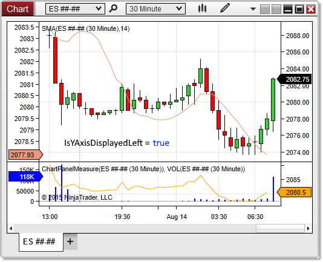



NinjaScript \> Language Reference \> Common \> Charts \> ChartPanel \> IsYAxisDisplayedLeft

IsYAxisDisplayedLeft

| \<\< [Click to Display Table of Contents](isyacisdisplayedleft_chartpanel.md) \>\> **Navigation:**     [NinjaScript](ninjascript-1.md) \> [Language Reference](language_reference_wip-1.md) \> [Common](common-1.md) \> [Charts](chart-1.md) \> [ChartPanel](chartpanel-1.md) \> IsYAxisDisplayedLeft | [Previous page](h_height_chartpanel-1.md) [Return to chapter overview](chartpanel-1.md) [Next page](isyaxisdisplayedoverlay_chartpanel-1.md) |
| --- | --- |

## Definition

Indicates the y\-axis is visible on the left side of the chart panel.

## 

## Property Value

A bool indicating the y\-axis is visible to the left

 

## Syntax

ChartPanel.IsYAxisDisplayedLeft

## 

## Example

| ns |
| --- |
| protected override void OnRender(ChartControl chartControl, ChartScale chartScale) {    base.OnRender(chartControl, chartScale);      // Print a message if the y\-axis is visible on the left    if (ChartPanel.IsYAxisDisplayedLeft)        Print("The y\-axis is visible on the left"); } |

 

 

Based on the image below, IsYAxisDisplayedLeft confirms that the y\-axis displays to the left. In this image, the property would be set to true when applied to either chart panel.

 

