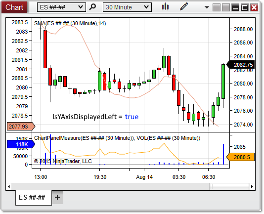



IsYAxisDisplayedLeft

|  |  |
| --- | --- |
| << [Click to Display Table of Contents](.\isyacisdisplayedleft_chartpanel.htm) >>  **Navigation:**  [NinjaScript](ninjascript-1.htm) > [Language Reference](language_reference_wip-1.htm) > [Common](common-1.htm) > [Charts](chart-1.htm) > [ChartPanel](chartpanel-1.htm) >  IsYAxisDisplayedLeft | [Previous page](h_height_chartpanel-1.htm) [Return to chapter overview](chartpanel-1.htm) [Next page](isyaxisdisplayedoverlay_chartpanel-1.htm) |

Definition
----------

Indicates the y-axis is visible on the left side of the chart panel.

Property Value
--------------

A bool indicating the y-axis is visible to the left

Syntax
------

ChartPanel.IsYAxisDisplayedLeft

Example
-------

| ns |
| --- |
| protected override void OnRender(ChartControl chartControl, ChartScale chartScale)  {     base.OnRender(chartControl, chartScale);        // Print a message if the y-axis is visible on the left     if (ChartPanel.IsYAxisDisplayedLeft)         Print("The y-axis is visible on the left");  } |

 

 

Based on the image below, IsYAxisDisplayedLeft confirms that the y-axis displays to the left. In this image, the property would be set to true when applied to either chart panel.

 

