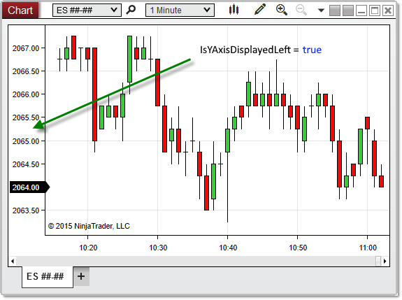


NinjaScript \> Language Reference \> Common \> Charts \> ChartControl \> IsYAxisDisplayedLeft
IsYAxisDisplayedLeft

| \<\< [Click to Display Table of Contents](isyaxisdisplayedleft.md) \>\> **Navigation:**     [NinjaScript](ninjascript.md) \> [Language Reference](language_reference_wip.md) \> [Common](common.md) \> [Charts](chart.md) \> [ChartControl](chartcontrol.md) \> IsYAxisDisplayedLeft | [Previous page](isstayindrawmode.md) [Return to chapter overview](chartcontrol.md) [Next page](isyaxisdisplayedoverlay.md) |
| --- | --- |

## Definition
Indicates the y\-axis displays (in any chart panel) to the left side of the chart.
## 
## Property Value
A boolean value. When True, indicates that the y\-axis displays to the left of the chart canvas; otherwise False.
## 
## Syntax
\<ChartControl\>.IsYAxisDisplayedLeft
## 
## Examples
| ns |
| --- |
| protected override void OnRender(ChartControl chartControl, ChartScale chartScale) {    // Print the value of IsYAxisDisplayedLeft    Print("Y\-Axis visible to the left of the chart canvas? " \+ chartControl.IsYAxisDisplayedLeft); } |

Based on the image below, IsYAxisDisplayedLeft confirms that the y\-axis displays to the left of the chart canvas.
 

