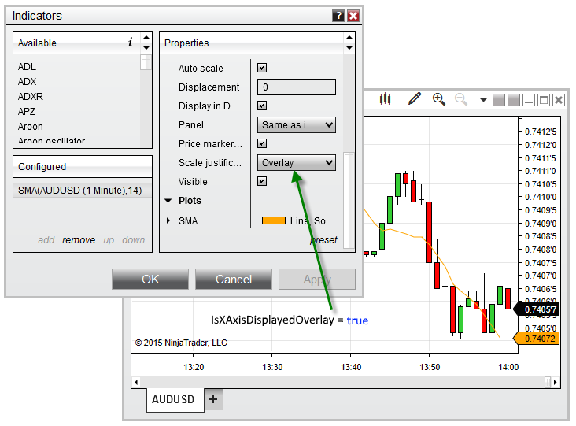


NinjaScript \> Language Reference \> Common \> Charts \> ChartControl \> IsYAxisDisplayedOverlay
IsYAxisDisplayedOverlay

| \<\< [Click to Display Table of Contents](isyaxisdisplayedoverlay.md) \>\> **Navigation:**     [NinjaScript](ninjascript.md) \> [Language Reference](language_reference_wip.md) \> [Common](common.md) \> [Charts](chart.md) \> [ChartControl](chartcontrol.md) \> IsYAxisDisplayedOverlay | [Previous page](isyaxisdisplayedleft.md) [Return to chapter overview](chartcontrol.md) [Next page](isyaxisdisplayedright.md) |
| --- | --- |

## Definition
Indicates an object on the chart is using the Overlay scale justification.
## 
## Property Value
A boolean value. When True, indicates that one or more objects on the chart are using the Overlay scale justification; otherwise False.
## 
## Syntax
\<ChartControl\>.IsYAxisDisplayedOverlay
## 
## Examples
| ns |
| --- |
| protected override void OnRender(ChartControl chartControl, ChartScale chartScale) {    // Print the value of IsYAxisDisplayedOverlay    Print("Is Overlay used? " \+ chartControl.IsYAxisDisplayedOverlay); } |

Based on the image below, IsYAxisDisplayedOverlay confirms that the an object on the chart, in this case an SMA indicator, is using the Overlay scale justification.
 

