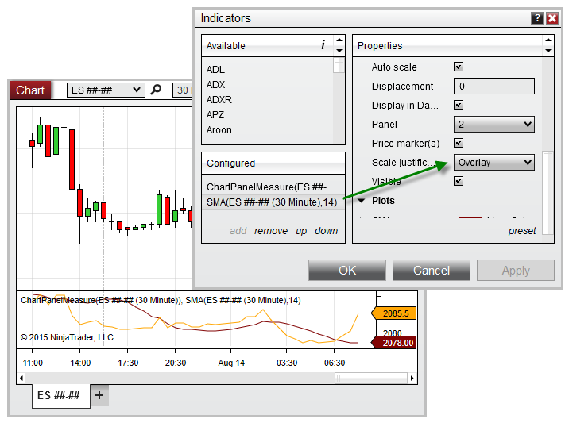

NinjaScript \> Language Reference \> Common \> Charts \> ChartPanel \> IsYAxisDisplayedOverlay
IsYAxisDisplayedOverlay

| \<\< [Click to Display Table of Contents](isyaxisdisplayedoverlay_chartpanel.md) \>\> **Navigation:**     [NinjaScript](ninjascript-1.md) \> [Language Reference](language_reference_wip-1.md) \> [Common](common-1.md) \> [Charts](chart-1.md) \> [ChartPanel](chartpanel-1.md) \> IsYAxisDisplayedOverlay | [Previous page](isyacisdisplayedleft_chartpanel-1.md) [Return to chapter overview](chartpanel-1.md) [Next page](isyaxisdisplayedright_chartpanel-1.md) |
| --- | --- |

## Definition
Indicates any objects configured in the panel are using the Overlay scale justification.
## 
## Property Value
A bool indicating any objects use the Overlay scale justification
 
## Syntax
ChartPanel.IsYAxisDisplayedOverlay
## 
## Example
| ns |
| --- |
| protected override void OnRender(ChartControl chartControl, ChartScale chartScale) {    base.OnRender(chartControl, chartScale);      // Trigger an alert when the Overlay scale justification is used    if (ChartPanel.IsYAxisDisplayedOverlay)        Alert("overlayAlert", Priority.Low, "It is not recommended to use 'Overlay' with this indicator", "", 300, Brushes.Yellow, Brushes.Black); } |

Based on the image below, IsYAxisDisplayedOverlay is set to True, since the SMA indicator is using the Overlay scale justification.
 

