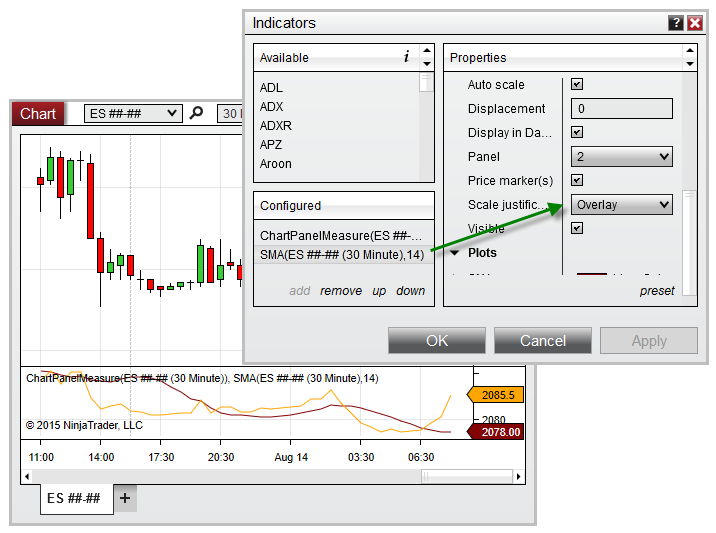


NinjaScript > Language Reference > Common > Charts > ChartPanel > IsYAxisDisplayedOverlay
IsYAxisDisplayedOverlay

| << [Click to Display Table of Contents](isyaxisdisplayedoverlay_chartpanel.md) >> **Navigation:**     [NinjaScript](ninjascript.md) > [Language Reference](language_reference_wip.md) > [Common](common.md) > [Charts](chart.md) > [ChartPanel](chartpanel.md) > IsYAxisDisplayedOverlay | [Previous page](isyacisdisplayedleft_chartpanel.md) [Return to chapter overview](chartpanel.md) [Next page](isyaxisdisplayedright_chartpanel.md) |
| --- | --- |

## Definition
Indicates any objects configured in the panel are using the Overlay scale justification.
## 
## Property Value
A bool indicating any objects use the Overlay scale justification
 
## Syntax
ChartPanel.IsYAxisDisplayedOverlay
## 
## Example
| ns |
| --- |
| protected override void OnRender(ChartControl chartControl, ChartScale chartScale) {    base.OnRender(chartControl, chartScale);      // Trigger an alert when the Overlay scale justification is used    if (ChartPanel.IsYAxisDisplayedOverlay)        Alert("overlayAlert", Priority.Low, "It is not recommended to use 'Overlay' with this indicator", "", 300, Brushes.Yellow, Brushes.Black); } |

Based on the image below, IsYAxisDisplayedOverlay is set to True, since the SMA indicator is using the Overlay scale justification.
 

