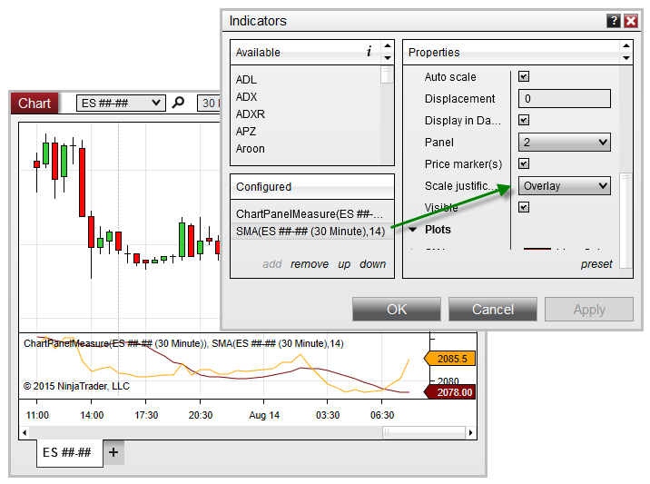



IsYAxisDisplayedOverlay

|  |  |
| --- | --- |
| << [Click to Display Table of Contents](isyaxisdisplayedoverlay_chartpanel.htm) >>  **Navigation:**  [NinjaScript](ninjascript.htm) > [Language Reference](language_reference_wip.htm) > [Common](common.htm) > [Charts](chart.htm) > [ChartPanel](chartpanel.htm) >  IsYAxisDisplayedOverlay | [Previous page](isyacisdisplayedleft_chartpanel.htm) [Return to chapter overview](chartpanel.htm) [Next page](isyaxisdisplayedright_chartpanel.htm) |

Definition
----------

Indicates any objects configured in the panel are using the Overlay scale justification.

Property Value
--------------

A bool indicating any objects use the Overlay scale justification

Syntax
------

ChartPanel.IsYAxisDisplayedOverlay

Example
-------

| ns |
| --- |
| protected override void OnRender(ChartControl chartControl, ChartScale chartScale)  {     base.OnRender(chartControl, chartScale);        // Trigger an alert when the Overlay scale justification is used     if (ChartPanel.IsYAxisDisplayedOverlay)         Alert("overlayAlert", Priority.Low, "It is not recommended to use 'Overlay' with this indicator", "", 300, Brushes.Yellow, Brushes.Black);  } |

 

 

Based on the image below, IsYAxisDisplayedOverlay is set to True, since the SMA indicator is using the Overlay scale justification.

 

