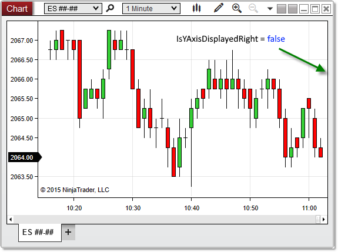

NinjaScript \> Language Reference \> Common \> Charts \> ChartControl \> IsYAxisDisplayedRight
IsYAxisDisplayedRight

| \<\< [Click to Display Table of Contents](isyaxisdisplayedright.md) \>\> **Navigation:**     [NinjaScript](ninjascript-1.md) \> [Language Reference](language_reference_wip-1.md) \> [Common](common-1.md) \> [Charts](chart-1.md) \> [ChartControl](chartcontrol-1.md) \> IsYAxisDisplayedRight | [Previous page](isyaxisdisplayedoverlay-1.md) [Return to chapter overview](chartcontrol-1.md) [Next page](lastslotpainted-1.md) |
| --- | --- |

## Definition
Indicates the y\-axis displays (in any chart panel) to the right side of the chart.
## 
## Property Value
A boolean value. When True, indicates that the y\-axis displays to the right of the chart canvas; otherwise False.
## 
## Syntax
\<ChartControl\>.IsYAxisDisplayedRight
## 
## Examples
| ns |
| --- |
| protected override void OnRender(ChartControl chartControl, ChartScale chartScale) {    // Print the value of IsYAxisDisplayedRight    Print("Y\-Axis visible to the right of the chart canvas? " \+ chartControl.IsYAxisDisplayedRight); } |

Based on the image below, IsYAxisDisplayedRight confirms that the y\-axis is not displayed to the right of the chart canvas.
 

