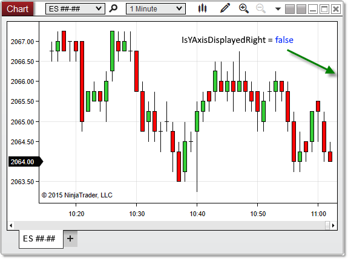



IsYAxisDisplayedRight

|  |  |
| --- | --- |
| << [Click to Display Table of Contents](isyaxisdisplayedright.htm) >>  **Navigation:**  [NinjaScript](ninjascript.htm) > [Language Reference](language_reference_wip.htm) > [Common](common.htm) > [Charts](chart.htm) > [ChartControl](chartcontrol.htm) >  IsYAxisDisplayedRight | [Previous page](isyaxisdisplayedoverlay.htm) [Return to chapter overview](chartcontrol.htm) [Next page](lastslotpainted.htm) |

Definition
----------

Indicates the y-axis displays (in any chart panel) to the right side of the chart.

Property Value
--------------

A boolean value. When True, indicates that the y-axis displays to the right of the chart canvas; otherwise False.

Syntax
------

<ChartControl>.IsYAxisDisplayedRight

Examples
--------

| ns |
| --- |
| protected override void OnRender(ChartControl chartControl, ChartScale chartScale)  {     // Print the value of IsYAxisDisplayedRight     Print("Y-Axis visible to the right of the chart canvas? " + chartControl.IsYAxisDisplayedRight);  } |

 

 

Based on the image below, IsYAxisDisplayedRight confirms that the y-axis is not displayed to the right of the chart canvas.

 

