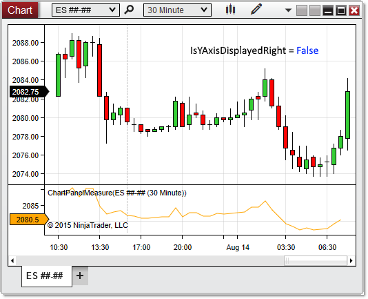



NinjaScript \> Language Reference \> Common \> Charts \> ChartPanel \> IsYAxisDisplayedRight

IsYAxisDisplayedRight

| \<\< [Click to Display Table of Contents](isyaxisdisplayedright_chartpanel.md) \>\> **Navigation:**     [NinjaScript](ninjascript.md) \> [Language Reference](language_reference_wip.md) \> [Common](common.md) \> [Charts](chart.md) \> [ChartPanel](chartpanel.md) \> IsYAxisDisplayedRight | [Previous page](isyaxisdisplayedoverlay_chartpanel.md) [Return to chapter overview](chartpanel.md) [Next page](maxvalue_chartpanel.md) |
| --- | --- |

## Definition

Indicates the y\-axis is visible on the right side of the chart panel.

## 

## Property Value

A bool indicating the y\-axis is visible to the right

 

## Syntax

ChartPanel.IsYAxisDisplayedRight

## 

## Example

| ns |
| --- |
| protected override void OnRender(ChartControl chartControl, ChartScale chartScale) {    base.OnRender(chartControl, chartScale);      // Print a message if the y\-axis is visible on the right    if (ChartPanel.IsYAxisDisplayedRight)        Print("The y\-axis is visible on the right"); } |

 

 

Based on the image below, IsYAxisDisplayedRight confirms that the y\-axis is not displayed on the right. The property would be set to false when applied in either chart panel in this instance.

 

