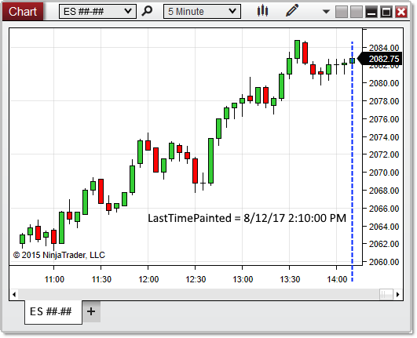


NinjaScript \> Language Reference \> Common \> Charts \> ChartControl \> LastTimePainted

LastTimePainted

| \<\< [Click to Display Table of Contents](lasttimepainted.md) \>\> **Navigation:**     [NinjaScript](ninjascript-1.md) \> [Language Reference](language_reference_wip-1.md) \> [Common](common-1.md) \> [Charts](chart-1.md) \> [ChartControl](chartcontrol-1.md) \> LastTimePainted | [Previous page](lastslotpainted-1.md) [Return to chapter overview](chartcontrol-1.md) [Next page](mousedownpoint-1.md) |
| --- | --- |
## Definition
Indicates the time of the most recently painted bar on the primary [Bars](bars-1.md) object configured on the chart.
## 
## Property Value
A [DateTime](https://msdn.microsoft.com/en-us/library/system.datetime(v=vs.110).aspx) object corresponding to the slot index of the most recently painted bar
## 
## Syntax
\<ChartControl\>.LastTimePainted
## 
## Example

| ns |
| --- |
| protected override void OnRender(ChartControl chartControl, ChartScale chartScale) {    DateTime lastSlotTime \= chartControl.LastTimePainted;      // Print the index of the last slot painted on the chart    Print(lastSlotTime); } |

In the image below, LastTimePainted reveals that the last index painted on the chart corresponds to 8/12/17 at 2:10:00 PM.
 

