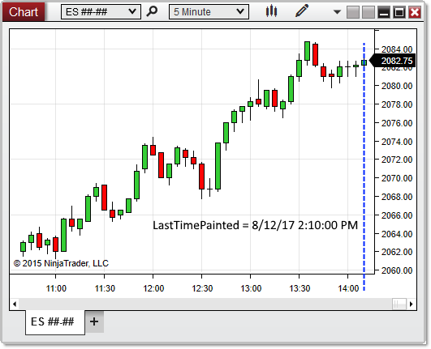



LastTimePainted

|  |  |
| --- | --- |
| << [Click to Display Table of Contents](.\lasttimepainted.htm) >>  **Navigation:**  [NinjaScript](ninjascript-1.htm) > [Language Reference](language_reference_wip-1.htm) > [Common](common-1.htm) > [Charts](chart-1.htm) > [ChartControl](chartcontrol-1.htm) >  LastTimePainted | [Previous page](lastslotpainted-1.htm) [Return to chapter overview](chartcontrol-1.htm) [Next page](mousedownpoint-1.htm) |

Definition
----------

Indicates the time of the most recently painted bar on the primary [Bars](bars-1.htm) object configured on the chart.

Property Value
--------------

A [DateTime](https://msdn.microsoft.com/en-us/library/system.datetime(v=vs.110).aspx) object corresponding to the slot index of the most recently painted bar

Syntax
------

<ChartControl>.LastTimePainted

Example
-------

| ns |
| --- |
| protected override void OnRender(ChartControl chartControl, ChartScale chartScale)  {     DateTime lastSlotTime = chartControl.LastTimePainted;        // Print the index of the last slot painted on the chart     Print(lastSlotTime);  } |

 

 

In the image below, LastTimePainted reveals that the last index painted on the chart corresponds to 8/12/17 at 2:10:00 PM.

 

