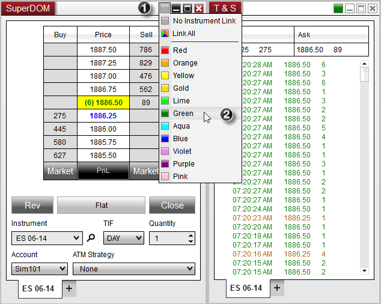

Operations \> Windows \> Using Window Linking

Using Window Linking

| \<\< [Click to Display Table of Contents](linking_windows.md) \>\> **Navigation:**     [Operations](operations.md) \> [Windows](window_tabs.md) \> Using Window Linking | [Previous page](window_tabs.md) [Return to chapter overview](window_tabs.md) [Next page](usingtheinstrumentselector.md) |
| --- | --- |
## Instrument Link
[Charts](charts.md), [Order entry](order_entry.md), [Alerts](alerts_log.md), [Time and Sales](time__sales.md), [News](news.md), FX Board and [Market Analyzer](market_analyzer.md) windows all have link buttons in the top right hand corner. Any window that is linked by color (each link button is set to the same color) will receive the same change of instrument request. That means that if you change, or select, an instrument in one window, all other linked windows will also change to that instrument.
 

 
## Interval Link
Charts has additional link functionality where you can link chart intervals. Meaning that any time you change an interval selection on a chart all linked windows would also change their interval.
 
## Link All
Selecting Link All will result in the specified window receiving transmission from windows with any link color selected.
