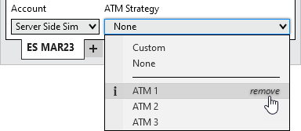

Operations \> Advanced Trade Management (ATM) \> Server Side ATMs \> Manage Server Side ATM Templates
Manage Server Side ATM Templates
| \<\< [Click to Display Table of Contents](manage-server-side-atm-templat.md) \>\> **Navigation:**     [Operations](operations-1.md) \> [Advanced Trade Management (ATM)](advanced_trade_management_atm-1.md) \> [Server Side ATMs](server-side-atm-strategy-1.md) \> Manage Server Side ATM Templates | [Previous page](server-side-stop-strategy-1.md) [Return to chapter overview](server-side-atm-strategy-1.md) [Next page](auto_close_position-1.md) |
| --- | --- |
An ATM Strategy is defined by the parameters you enter into the ATM Strategy parameters section on any of the order entry screens. The collection of parameters that make up a strategy can be saved as a template that you can recall at a later date to automatically populate all of the ATM Strategy parameters. Templates are specific to your account and the selected instrument.
 
## Saving ATM Strategy Templates
## To save your current ATM Strategy parameters in a template:
## 
## Select the Save as Template button
## 
## ServerSideATM_9
## 
## From the presented file dialog give the template a custom name, then press Save.
## 
## ServerSideATM_10
## 
## Removing an ATM Strategy Templates
Within the ATM Strategy dropdown menu, hover your mouse over the ATM Strategy you want to remove, then select remove.
 

 
