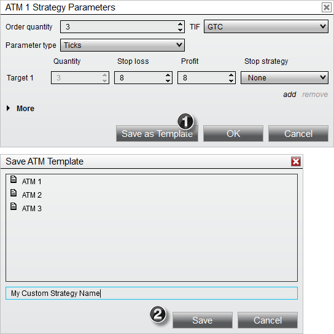
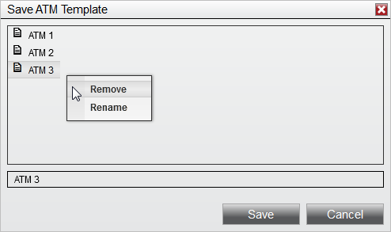


Operations \> Advanced Trade Management (ATM) \> ATM Strategy \> Manage ATM Strategy Templates

Manage ATM Strategy Templates

| \<\< [Click to Display Table of Contents](manage_atm_strategy_templates.md) \>\> **Navigation:**     [Operations](operations.md) \> [Advanced Trade Management (ATM)](advanced_trade_management_atm.md) \> [ATM Strategy](atm_strategy.md) \> Manage ATM Strategy Templates | [Previous page](auto_trail.md) [Return to chapter overview](atm_strategy.md) [Next page](tutorial_atm_strategy_example_.md) |
| --- | --- |
An ATM Strategy is defined by the parameters you enter into the ATM Strategy parameters section on any of the order entry screens. The collection of parameters that make up a strategy can be saved as a template that you can recall at a later date to automatically populate all of the ATM Strategy parameters.
 
## Saving ATM Strategy Templates
## To save your current ATM Strategy parameters in a template:
## 
1\.Select the Save as Template button

2\.From the presented file dialog give the template a custom name

 

 
## Removing or Renaming ATM Strategy Templates
Right clicking on an existing ATM Strategy template will give you the option to either Remove or Rename the strategy template.
 

 
See [ATM Strategy Example \#1](tutorial_atm_strategy_example_.md) and [ATM Strategy Example \#2](tutorial_atm_strategy_example2.md) for further reference on how to create and save an ATM Strategy template.
