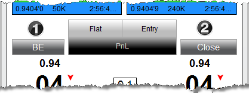


Operations > Order Entry > FX Pro > Managing Positions

Modifying and Cancelling Orders

| << [Click to Display Table of Contents](managing_positions_fx_pro.md) >> **Navigation:**     [Operations](operations-1.md) > [Order Entry](order_entry-1.md) > [FX Pro](fx_pro-1.md) > Modifying and Cancelling Orders | [Previous page](modifying_and_cancelling_orders_fx_pro-1.md) [Return to chapter overview](fx_pro-1.md) [Next page](properties_fx_pro-1.md) |
| --- | --- |
## How to Manage Open Positions
1. Clicking on the "BE" (break-even) button with your left mouse button will adjust any stop orders in the opposite direction of your open position (if position is long it will adjust stop sell orders) to the position's average entry price. Clicking on this button with your middle mouse button (scroll wheel) will only adjust any Stop Loss orders associated to the selected active ATM Strategy in the strategy drop down list. Orders resting at a better price than the average entry price will NOT be modified.
 
2. Clicking on the "Close" button with your left mouse button will close the current position and cancel any working orders associated to the instrument/account combination. Clicking on this button with your middle mouse button (scroll wheel) will close the selected active ATM Strategy only. This means that the position size of the ATM Strategy will be closed and any working orders associated to that ATM Strategy will be cancelled.
 

 
Please see the help topic on [Closing a Position or ATM Strategy](closing_a_position_or_atm_stra-1.md) for more information on the mechanics behind closing various types of positions.
