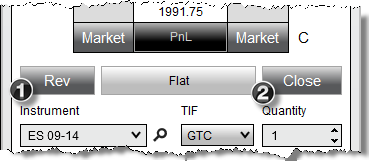



Operations \> Order Entry \> SuperDOM \> Managing Positions

Managing Positions

| \<\< [Click to Display Table of Contents](managing_positions_superdom.md) \>\> **Navigation:**     [Operations](operations.md) \> [Order Entry](order_entry.md) \> [SuperDOM](superdom.md) \> Managing Positions | [Previous page](modifying_and_cancelling_orders_superdom.md) [Return to chapter overview](superdom.md) [Next page](using_superdom_columns.md) |
| --- | --- |

[Show/Hide Hidden Text](javascript:HMToggleExpandAll(!HMAnyToggleOpen()) "Click to open/close expanding sections")

| playVideo |
| --- |
|  |

## 

The SuperDOM has action buttons that allow you to quickly: close open positions, reverse positions, or even add/remove targets to your ATM Strategy

 

 

1\.Left mouse clicking on the "Rev" will close the current open position and open a reverse position.

2\.Left mouse clicking on the "Close" will close the current position and cancel any working orders associated with the instrument/account combination. Clicking on this button with your middle mouse button (scroll wheel) will close the selected active strategy only. This means that the position size of the strategy will be closed and any working orders associated to that strategy will be cancelled.

 

 

| Note: Positions will only display for the selected Account and Instrument. |
| --- |

## 

        [How to scale in or out of an active ATM strategy](javascript:HMToggle('toggle','HowToScaleInOrOutOfAnActiveAtmStrategy','HowToScaleInOrOutOfAnActiveAtmStrategy_ICON'))

| When you have an [active strategy selected](atm_strategy_selection_mode.md) in the strategy control list indicated by the active_atm lightning bolt icon (see image below), orders submitted scale into or out of the selected strategy. Once filled or partially filled, existing stop loss and profit target orders are modified to reflect the new position strategy size. You can preset a default scale in or out quantity via the "Scale quantity" property accessible via the [SuperDOM properties](properties_superdom.md) window.    SuperDOM_35   As an example, your initial strategy may call for opening a position of 4 contracts but you want subsequent scale orders to be only 1 contracts. If the SuperDOM "Scale quantity" property is set to a value of 1, when an active strategy is selected in the strategy control list, the SuperDOM "Order qty" field will be set to a value of 1 automatically. |
| --- |

        [Adding or Removing Targets](javascript:HMToggle('toggle','AddingOrRemovingTargets','AddingOrRemovingTargets_ICON'))

| How to Add or Remove Targets If you have an active ATM strategy displayed in the SuperDOM, you can add or remove targets. For example, you may have a 2 contract position with 1 Stop Loss and Profit Target for 2 contracts each. You may decide to split this target (add target) so you can exit the final contract at a higher price.   It is important to understand the following logic: •If you have 1 target and you remove a target, you will be left with a stop loss order only•New targets are added 4 ticks from your current outside target for futures, $0\.20 for stocks  Two Methods for Adding and Removing Targets There are two locations within the SuperDOM where you can add or remove a target. 1\.Pressing down on the Left mouse button on the "\+ TARGET" (to add) or "\- TARGET" (to remove) buttons when "Show Quick Buttons" is set to True in the [SuperDOM properties](properties_superdom.md) dialog window2\. Right mouse click context menu and select Add Target or Remove Target |
| --- |

