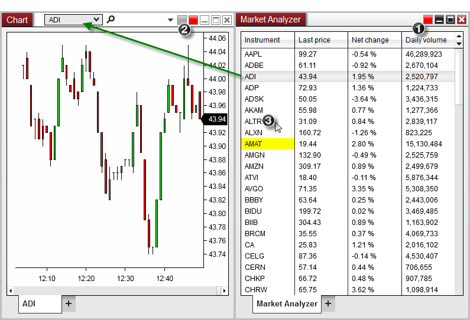


Operations > Market Analyzer > Window Linking

Window Linking

| << [Click to Display Table of Contents](marketanalzyer_window_linking.md) >> **Navigation:**     [Operations](operations.md) > [Market Analyzer](market_analyzer.md) > Window Linking | [Previous page](reloading_indicators__columns.md) [Return to chapter overview](market_analyzer.md) [Next page](market-watch.md) |
| --- | --- |
One of the most useful features of the Market Analyzer is the ability to link the instruments displayed in the Market Analyzer grid to any other window in the NinjaTrader application.  This allows you to cycle through a custom list of instruments and quickly load the desired symbols in a Chart, SuperDOM, or any other feature which uses the [Window Linking](linking_windows.md) feature.
 
In order to accomplish this setup, please see the steps and image below:
 
1.Select a Link Color in the Market Analyzer 

2.Select the same Link Color in any number of windows you wish to have updated

3.Using your mouse, left or right mouse click on any instrument row in the Market Analyzer

 
In the example image below, doing so will change the current instrument displayed in the Chart (ADI) with the instrument that was selected in the Market Analyzer (ALTR).  
 
All windows that are linked by the same color will receive the same change of instrument request.  
 

