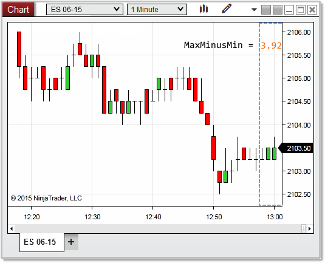


NinjaScript > Language Reference > Common > Charts > ChartScale > MaxMinusMin

MaxMinusMin

| << [Click to Display Table of Contents](maxminusmin.md) >> **Navigation:**     [NinjaScript](ninjascript.md) > [Language Reference](language_reference_wip.md) > [Common](common.md) > [Charts](chart.md) > [ChartScale](chartscale.md) > MaxMinusMin | [Previous page](chartscale_isvisible.md) [Return to chapter overview](chartscale.md) [Next page](chartscale_maxvalue.md) |
| --- | --- |
## Definition
The difference between the chart scale's [MaxValue](chartscale_maxvalue.md) and [MinValue](chartscale_minvalue.md) represented as a y value.
## 
## Property Value
A double value representing the difference in scale as a y value.
## 
## Syntax
<chartScale>.MaxMinusMin
## 
## Examples

| ns |
| --- |
| protected override void OnRender(ChartControl chartControl, ChartScale chartScale) {             // the difference between the scales maximum and minimum value    double   maxMinusMin = chartScale.MaxMinusMin;        Print("maxMinusMin: " + maxMinusMin); // maxMinusMin: 3.92 } |

In the image below, the highest calculated value on the chart scale is 2106.21, with the lowest value being 2102.29;  the MaxMinusMin property therefore provides us calculated value of 3.92.
 

