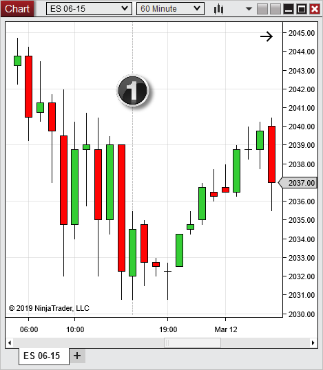
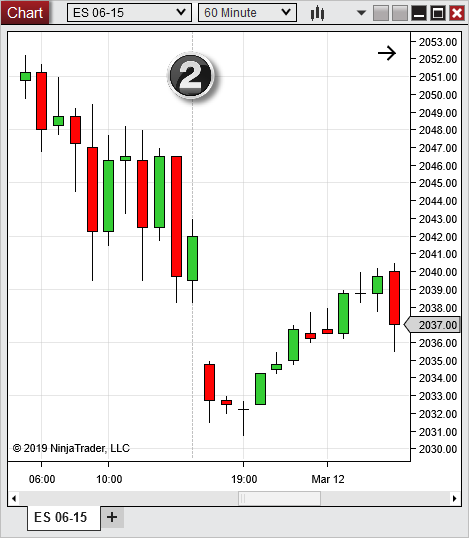
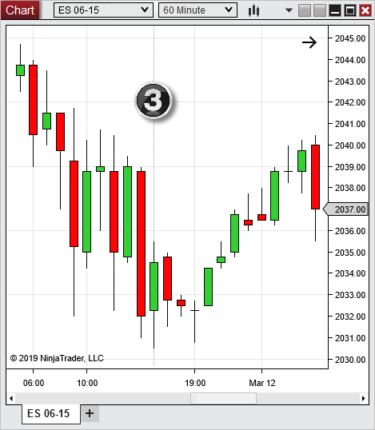


Configuration > Options > Market data > Merge Policy

Merge Policy

| << [Click to Display Table of Contents](merge_policy.md) >> **Navigation:**     [Configuration](configuration-1.md) > [Options](options-1.md) > [Market data](options_marketdata-1.md) > Merge Policy | [Previous page](splits_and_dividends-1.md) [Return to chapter overview](options_marketdata-1.md) [Next page](real_time_tick_filter-1.md) |
| --- | --- |
## Merge Policy
The Merge Policy option can be found in the [Market Data](options_marketdata-1.md) category of the Options menu and sets how NinjaTrader handles the merging of historical data for futures contracts during a contract rollover.  For example: If requesting a chart of the ES 06-15 from March 1st through April 1st, two contract months were the front month during that time span (03-15 and 06-15).  The way the chart will display those contracts will depend on the following settings and are illustrated below.
 

| Note: More information on Configuring Rollover Dates and Offsets can be found in the [Editing Instruments](editing_instruments-1.md) section of the Help Guide. |
| --- |
 
MergeBackAdjusted
- Data from each individual expiry month across the time span of the historical data request is loaded

- Offset values will be used to back adjust the historical price data to match the next front month

 
Selecting this option, the 03-15 data will be merged with the 06-15 data on the date of rollover (March 12th, 2015) and an Offset value will be used to connect the previous 03-15 contract price point with the first 06-15 contract point. 
 
The result is a continuous chart of ES front month data for the dates selected.  Price is seamlessly merged between each contract month.
 

 
MergeNonBackAdjusted
- Data from each individual expiry month across the time span of the historical data request is loaded

- Offset values are NOT used and leaves historical data as raw data

 
Selecting this option, the 03-15 data will be merged with the 06-15 data on the date of rollover (March 12th, 2015); however, NO Offset value will be applied. 
 
The result is a continuous chart of ES front month data for the dates selected.  Significant price gaps in the chart may be present due to changes in contract values that were NOT Offset.
 

 
DoNotMerge
- Data from ONLY the selected expiry month across the time span of the historical data requested is loaded

- Offset values are NOT used and leaves historical data as raw data.

 
Selecting this option will only show historical data for the front month selected.  The 03-14 data will NOT be merged and ONLY data for the 06-15 contract will be used. 
 
The result is a chart that goes as far back as there is data for the selected front month, which may be less than the requested date range.
 

