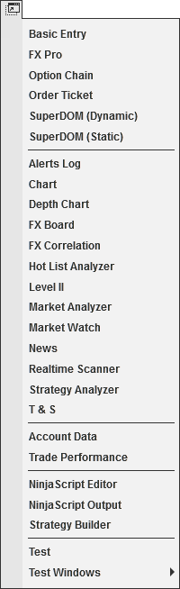


Operations \> Control Center \> New Menu
New Menu

| \<\< [Click to Display Table of Contents](new_menu.md) \>\> **Navigation:**     [Operations](operations-1.md) \> [Control Center](control_center-1.md) \> New Menu | [Previous page](control_center-1.md) [Return to chapter overview](control_center-1.md) [Next page](tools_menu-1.md) |
| --- | --- |

The following menus and items are available via the New menu of the NinjaTrader Control Center.
 

 
| [Basic Entry](basic_entry-1.md) | Creates new Basic Entry window |
| --- | --- |
| [FX Pro](fx_pro-1.md) | Creates a new FX Pro window |
| [Options Chain](option-chain-1.md) | Created a new Option Chain window |
| [Order Ticket](order_ticket-1.md) | Creates a new Order Ticket window |
| [SuperDOM](superdom-1.md) (Dynamic) | Creates a new SuperDOM (Dynamic) window |
| [SuperDOM](superdom-1.md) (Static) | Creates a new SuperDOM (Static) window |
| [Alerts Log](alerts_log-1.md) | Creates a new Alerts Log window |
| [Chart](charts-1.md) | Creates a new Chart window |
| [FX Board](fx_board-1.md) | Creates a new FX Board window |
| [Hot List Analyzer](hot_list_analyzer-1.md) | Creates a new Hot List Analyzer window |
| [Level II](level_ii-1.md) | Creates a new Level II window |
| [Market Analyzer](market_analyzer-1.md) | Creates a new Market Analyzer window |
| [Market Watch](market-watch-1.md) | Created a new Market Watch window |
| [News](news-1.md) | Creates a new News window |
| [Strategy Analyzer](strategy_analyzer-1.md) | Creates a new Strategy Analyzer window |
| [T \& S](time__sales-1.md) | Creates a new Time \& Sales window |
| Account Data | Creates a new Account Data window |
| [Trade Performance](trade_performance-1.md) | Creates a new Trade Performance window |
| [NinjaScript Editor](editor-1.md) | Creates a new NinjaScript Editor window |
| [NinjaScript Output](output-1.md) | Opens the NinjaScript output window (this includes the NinjaScript Utilization Monitor subwindow) |
| [Strategy Builder](strategy_builder-1.md) | Creates a new Strategy Builder window |
| [AddOn Framework](addon_development_overview-1.md) | This is an example for a custom NinjaScript AddOn installed |

