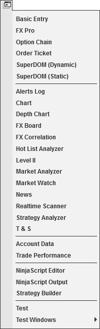



New Menu

|  |  |
| --- | --- |
| << [Click to Display Table of Contents](new_menu.htm) >>  **Navigation:**  [Operations](operations.htm) > [Control Center](control_center.htm) >  New Menu | [Previous page](control_center.htm) [Return to chapter overview](control_center.htm) [Next page](tools_menu.htm) |

The following menus and items are available via the New menu of the NinjaTrader Control Center.

|  |  |
| --- | --- |
| [Basic Entry](basic_entry.htm) | Creates new Basic Entry window |
| [FX Pro](fx_pro.htm) | Creates a new FX Pro window |
| [Options Chain](option-chain.htm) | Created a new Option Chain window |
| [Order Ticket](order_ticket.htm) | Creates a new Order Ticket window |
| [SuperDOM](superdom.htm) (Dynamic) | Creates a new SuperDOM (Dynamic) window |
| [SuperDOM](superdom.htm) (Static) | Creates a new SuperDOM (Static) window |
| [Alerts Log](alerts_log.htm) | Creates a new Alerts Log window |
| [Chart](charts.htm) | Creates a new Chart window |
| [FX Board](fx_board.htm) | Creates a new FX Board window |
| [Hot List Analyzer](hot_list_analyzer.htm) | Creates a new Hot List Analyzer window |
| [Level II](level_ii.htm) | Creates a new Level II window |
| [Market Analyzer](market_analyzer.htm) | Creates a new Market Analyzer window |
| [Market Watch](market-watch.htm) | Created a new Market Watch window |
| [News](news.htm) | Creates a new News window |
| [Strategy Analyzer](strategy_analyzer.htm) | Creates a new Strategy Analyzer window |
| [T & S](time__sales.htm) | Creates a new Time & Sales window |
| Account Data | Creates a new Account Data window |
| [Trade Performance](trade_performance.htm) | Creates a new Trade Performance window |
| [NinjaScript Editor](editor.htm) | Creates a new NinjaScript Editor window |
| [NinjaScript Output](output.htm) | Opens the NinjaScript output window (this includes the NinjaScript Utilization Monitor subwindow) |
| [Strategy Builder](strategy_builder.htm) | Creates a new Strategy Builder window |
| [AddOn Framework](addon_development_overview.htm) | This is an example for a custom NinjaScript AddOn installed |