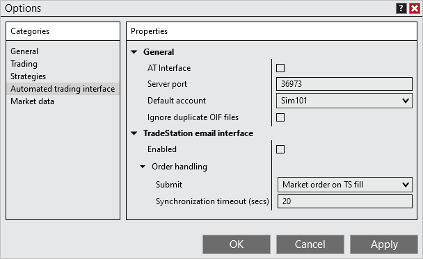


Configuration > Options > Automated trading interface

Automated trading interface

| << [Click to Display Table of Contents](options_ati.md) >> **Navigation:**     [Configuration](configuration-1.md) > [Options](options-1.md) > Automated trading interface | [Previous page](options_strategies-1.md) [Return to chapter overview](options-1.md) [Next page](options_marketdata-1.md) |
| --- | --- |
The Automated trading interface section sets options for the [Automated Trading Interface](automated_trading_interface_at-1.md).
 

 
## General Properties
This property group sets the general ATI (Automated trading interface) properties.
 

| General |  |
| --- | --- |
| AT Interface | Sets if the automated trading interface is enabled. This will not affect the remaining API methods. |
| Server port | Default port number for communicating with NinjaTrader via the DLL interface. |
| Default account | Sets the default account for automated trading. If no account is specified the default account is used. |
| Ignore duplicate OIF files | Enables or disables ignoring duplicate OIF files. If enabled, any OIF files with the same name during the current NinjaTrader session will be ignored. |
## 
## TradeStation Email Interface Properties
This property group sets the TradeStation email interface properties. Detailed information on the TradeStation email interface can be found [here](tradestation_email_integration-1.htm "e").
 

| Enabled | Sets if the Tradestation email interface is enabled. |
| --- | --- |
| Order handling |  |
| Submit | Sets how NinjaTrader will handle orders submitted from the email interface.   Market orders on TS fill: NinjaTrader will submit market orders when NinjaTrader receives a strategy order filled email notification from TradeStation.   Submit as is: NinjaTrader will submit the specified order type (market, limit and stop) when a strategy active order email notification is received from TradeStation. There are additional properties that become available when this mode is enabled that allow for some additional protections to attempt to prevent the Tradestation strategy from being out of sync with NinjaTrader, in contrast to the "Submit and forget" method below.   Submit and forget:  NinjaTrader will submit the specified order type (market, limit and stop) when a strategy active order email notification is received from TradeStation. |
| Delay conversion of unfilled amount to market after TS fill (secs) | Number of seconds NinjaTrader will delay converting any unfilled NinjaTrader orders after Tradestation reports it has filled the orders. This only applies to the order handling "Submit as is" mode. |
| Synchronization timeout (secs) | Number of seconds NinjaTrader will provide a pop up notification if order are out of synchronization (For example; TS reports a fill but NinjaTrader live order is not filled) |
| Stop Orders |  |
| Submit | Sets how NinjaTrader will handle stop orders submitted from the email interface. This property only applies to the order handling mode "Submit as is".   Submit as is: Submits the specified stop order when NinjaTrader receives a strategy active order email notification from TradeStation   Convert to stop limit: Submits a stop-limit order when NinjaTrader receives a strategy active order email notification from TradeStation for any stop order type. The property "Limit price offset as ticks" will be made available where you set the amount of ticks the limit price is offset from the stop price.   Submit as simulated stop: Submits a locally simulated stop-market order when NinjaTrader receives a strategy active order email notification from TradeStation for any stop order type. See more information on simulated stops [here](simulated_stop_orders-1.md). |
| Submit market order if stop order was rejected | If a stop order is rejected for any reason, a market order will be sent. Please see the [following section for disclaimer and risks](stop_order_handling-1.md) of this feature. |
