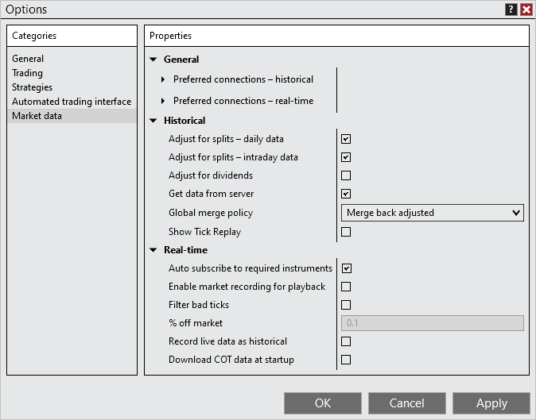


Configuration \> Options \> Market data

Market data

| \<\< [Click to Display Table of Contents](options_marketdata.md) \>\> **Navigation:**     [Configuration](configuration-1.md) \> [Options](options-1.md) \> Market data | [Previous page](options_ati-1.md) [Return to chapter overview](options-1.md) [Next page](splits_and_dividends-1.md) |
| --- | --- |
The Market data section sets options related to market data and database management.
 

 

| General |  |
| --- | --- |
| Preferred connections \- historical | Sets a connection to be used by NinjaTrader for historical data if it is connected. You can choose a separate preferred connection for each instrument type, expand the triangle to the left of the property name to set a preferred connection. |
| Preferred connections \- real\-time | Sets a connection to be used by NinjaTrader for real\-time data if it is connected. You can choose a separate preferred connection for each instrument type, expand the triangle to the left of the property name to set a preferred connection. |
| Historical |  |
| Adjust for splits \- daily data | Enables or disables split adjusting historical data for daily data. Some providers already split adjust their daily data and you do not need to adjust it a second time if your provider handles it on their side. Please see [this](splits_and_dividends-1.md) help guide page under the section "Understanding splits and dividends" for more information. |
| Adjust for splits \- intraday data | Enables or disables split adjusting historical data for intraday data. Some providers already split adjust their intraday data and you do not need to adjust it a second time if your provider handles it on their side. Please see [this](splits_and_dividends-1.md) help guide page under the section "Understanding splits and dividends" for more information. |
| Adjust for dividends | Enables or disables the adjustment of historical data to account dividends, for use with any function that requires historical market data |
| Get data from server | Enables or disables the retrieving of historical data from the data provider's server while connected. When disabled, historical data will still download when connecting, manually reloading historical data, or manually downloading historical data. |
| Global merge policy | Sets the merge policy for Futures contracts:   Do not merge: historical data is not merged   Merge back adjusted: NinjaTrader automatically merges and back adjusts historical data   Merge non back adjusted: NinjaTrader automatically merges, but does not back adjust, historical data   For more information on merge policies, see the "Understanding merge policies" section on [this](merge_policy-1.md) page. |
| Show Tick Replay | When enabled, allows "Tick Replay" to be configured from a data series menu.  Please see [Tick Replay](tick_replay-1.md) for more information. |
| Real\-time |  |
| Auto subscribe to required instruments | Sets whether NinjaTrader will automatically subscribe to market data for any instruments requiring data throughout the platform to properly calculate PnL when trading non\-USD pairs |
| Enable market recording of playback | Enables or disables market data recording for use with the [Playback Connection](playback_connection-1.md) |
| Filter bad ticks | Enables or disable filtering of bad ticks. This filtering only works on real\-time data and will filter ticks that are a greater then a set percentage away from the last tick. Set the percentage for filtering with the property: "% off market". Note: If NinjaTrader receives 2 or more ticks that violate the tick filter we will no longer filter the ticks as the market is assumed to have legitimately gapped up or down. |
| % off market | Sets the real\-time tick filter offset percentage (0\.1 equals 1/10 of a percent) |
| Record live data as historical | Enables or disables the storage of incoming real\-time [Chart](charts-1.md) data to your local PC for future historical data requests. If you are connected to a provider that supports historical data, disable this feature. |
| Download COT data at startup | Allows downloading of Commitment of Traders data for use with the [COT](cot-1.md) indicator |
