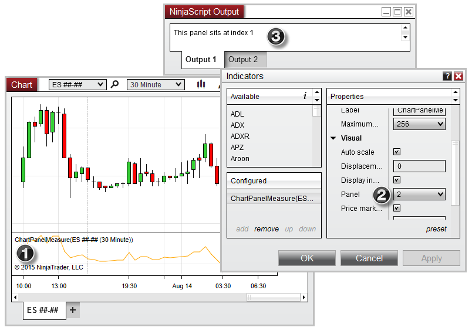



NinjaScript \> Language Reference \> Common \> Charts \> ChartPanel \> PanelIndex

PanelIndex

| \<\< [Click to Display Table of Contents](panelindex_chartpanel.md) \>\> **Navigation:**     [NinjaScript](ninjascript.md) \> [Language Reference](language_reference_wip.md) \> [Common](common.md) \> [Charts](chart.md) \> [ChartPanel](chartpanel.md) \> PanelIndex | [Previous page](minvalue_chartpanel.md) [Return to chapter overview](chartpanel.md) [Next page](chartscale_chartpanel.md) |
| --- | --- |

## Definition

Indicates the index of the chart panel in the collection of configured panels. 

 

| Note:  This property comes from a zero\-based index, which is not the same as the panel number displayed in the Indicators window opened from within the chart. The panel number displayed in the Indicators window will equate to ChartPanel.PanelIndex \+ 1. |
| --- |

## 

## Property Value

A int representing the zero\-based index of the panel

 

## Syntax

ChartPanel.PanelIndex

## 

## Example

| ns |
| --- |
| protected override void OnRender(ChartControl chartControl, ChartScale chartScale) {    base.OnRender(chartControl, chartScale);      // Print the panel's zero\-based index    Print(String.Format("This panel sits at index {0}",ChartPanel.PanelIndex)); } |

 

 

Notice three things in the image below:

 

1\) An indicator containing the example code above is configured on the second chart panel

2\) In the Indicators window, the "Panel" property is set to 2

3\) The output of the example code displays the zero\-based index of Panel \#2, which is at index 1

 

