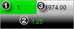


Operations > Order Entry > Trade Controls > Position Display

Position Display

| << [Click to Display Table of Contents](position_display.md) >> **Navigation:**     [Operations](operations-1.md) > [Order Entry](order_entry-1.md) > [Trade Controls](trade_controls-1.md) > Position Display | [Previous page](closing_a_position_or_atm_stra-1.md) [Return to chapter overview](trade_controls-1.md) [Next page](price_selector-1.md) |
| --- | --- |
The current selected account and instrument's position will be reflected directly on the Order Entry window with the following information:
 
1.Position Quantity and Direction Display

2.PnL (Profit and Loss) Display

3.Average Entry Price Display

 

## 
The image above shows that we are in a 1 Long position, with an Average Entry Price of 1974.00, and that our current open PnL is 1.25 points.
 
Tip:  If you are trading using multiple ATM Strategies, it is possible to reconfigure the position display to only display the position of the current selected ATM Strategy.  Please see our Help Guide section on [ATM Strategy Selection](atm_strategy_selection_mode-1.md) mode for more information.
        [Understanding Position Quantity and Direction Display](javascript:HMToggle('toggle','UnderstandingPositionQuantityAndDirectionDisplay','UnderstandingPositionQuantityAndDirectionDisplay_ICON'))

| Position Information The current number of contracts in position will be displayed as a number in the position display.  The direction of the position will be also represented in a highly visual manner:   - When not in a position, the text display will say "Flat" without a color- Long positions will be reflected by a Green background color- Short positions will be reelected by a Red background color |
| --- |
        [Understanding Average Entry Price Display](javascript:HMToggle('toggle','UnderstandingAverageEntryPriceDisplay','UnderstandingAverageEntryPriceDisplay_ICON'))

| Average Entry Price  When in a position, the Average Entry Price Display will show you the current price which is being used to calculate your open PnL.  As you scale in and scale out of position at different prices, your Average Entry Price will be recalculated to reflect the new average price.  The way this is calculated is set under the [Trading](options_trading-1.md) category of NinjaTrader's general options menu.     | Note:  The SuperDOM's average entry price will be displayed directly on the [Price ladder display](price_ladder_display-1.md) rather than a text field. | | --- | |
| --- | --- |
        [Understanding PnL Display](javascript:HMToggle('toggle','UnderstandingPnlDisplay','UnderstandingPnlDisplay_ICON'))

| Profit and Loss The PnL Display can be easily switched between Currency, Percent, Points, Pips, Ticks and None (hides your PnL).  There are two ways to configure the PnL Display:   1.Single left clicking on the PnL Display itself will cycle between each display mode (with the exception of "none")2.Right clicking on the order entry feature and selecting Properties will allow you to select the PnL display unit property directly  You can also configure the PnL Display to show you your selected account's Realized PnL for the current trading session when not in a position.  To enable this feature, right click on the order entry feature, select Properties, and check Show realized PnL when Flat.     | Tip: Show realized PnL when Flat will show you your overall account PnL and not the selected instrument's PnL.  If you'd like to see each individual instruments PnL, you can use the Market Analyzer's Realized profit loss and Unrealized profit loss [Columns](working_with_columns-1.md) to display this information per instrument. | | --- |        | Note: When viewed in Ticks, Points, or Pips the PnL will be calculated according to the average entry price for one unit. When viewed in Currency, PnL will be multiplied by the number of units in a position. When viewed in Percent, PnL will be percentage change of the Average Entry Price. This is due to the fact that the Ticks, Points, and Pips display modes are intended to provide easily comparable measures of raw performance between trades, by eliminating the position size from the equation. | | --- | |
| --- | --- | --- |

