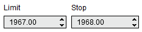


Operations \> Order Entry \> Trade Controls \> Price Selector
Price Selector
| \<\< [Click to Display Table of Contents](price_selector.md) \>\> **Navigation:**     [Operations](operations-1.md) \> [Order Entry](order_entry-1.md) \> [Trade Controls](trade_controls-1.md) \> Price Selector | [Previous page](position_display-1.md) [Return to chapter overview](trade_controls-1.md) [Next page](quantity_selector-1.md) |
| --- | --- |
NinjaTrader order entry feature which have the ability to place custom orders for Stop\-Market, Stop\-Limit, Limit and MIT orders such as the [Order Ticket,](order_ticket-1.md) [Basic Entry](basic_entry-1.md), [FX Pro](fx_pro-1.md), and [FX Board](fx_board-1.md) use a standard Price Selector which is used to specify the exact price used for these types of orders.  
 

 
## Setting and Adjusting Price
The price selector allows you type directly into the editor to specify a price, however you can also use a few shortcuts to obtain current market prices, as well as make quick adjustments to the selected price using your mouse.  The table below shows the various shortcuts that can be used with the Price Selector:
 
| Middle Mouse Click | Sets the current Last Price |
| --- | --- |
| Ctrl \+ Middle Mouse Click | Sets the current Ask Price |
| Alt \+ Middle Mouse Click | Sets the current Bid Price |
| Middle Scroll Up/Down | Adjusts the current price 1 tick |
| Ctrl \+ Middle Scroll Up/Down | Adjusts the current price 10 ticks |

 
## Order Types and Price Fields
Upon selecting an order type, the relevant fields specific to that type of order will be enabled to allow you to edit the order price before submitting the order.  If a field is not relevant to an order type, it will be disabled.  Note that a Stop\-Limit order has both fields enabled which implies that both fields must have a value in order to place this type of order.   
 
| Limit Order \- Limit Field Shared_Trade_Controls_6 |
| --- |
| Market Order \- No Fields Shared_Trade_Controls_7 |
| MIT Order \- Stop Field Shared_Trade_Controls_8 |
| Stop\-Limit Order \- Stop and Limit Fields Shared_Trade_Controls_9 |
| Stop\-Market Order \- Stop Field Shared_Trade_Controls_10 |
