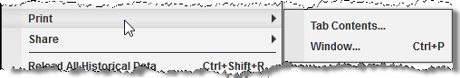


Operations \> Windows \> Printing Content
Printing Content
| \<\< [Click to Display Table of Contents](printing_content.md) \>\> **Navigation:**     [Operations](operations.md) \> [Windows](window_tabs.md) \> Printing Content | [Previous page](sharing_content.md) [Return to chapter overview](window_tabs.md) [Next page](using_color_pickers.md) |
| --- | --- |
## How to print content in NinjaTrader
NinjaTrader has a generic approach to printing which can be accessed via the right mouse click menu on any print enabled window. 
 

 
The print options available to you will vary depending on the window you choose to print from, in the screenshot above there are two options:
 
| Tab Contents... | Opens the print dialog to configure print options for printing a screenshot of the Tab |
| --- | --- |
| Window... | Opens the print dialog to configure print options for printing a screenshot of the window. |
