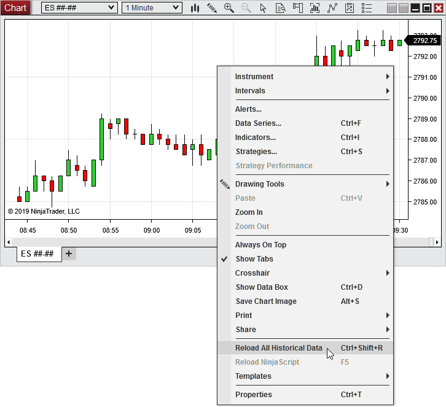

Operations > Charts > Reload Historical Data

Reload Historical Data

| << [Click to Display Table of Contents](reload_historical_data.md) >> **Navigation:**     [Operations](operations.md) > [Charts](charts.md) > Reload Historical Data | [Previous page](chart_properties.md) [Return to chapter overview](charts.md) [Next page](how_bars_are_built.md) |
| --- | --- |
While you are connected to a market data provider that supports [historical data](data_by_provider.md), right mouse click within a chart to bring up the context menu and select the Reload All Historical Data menu item. Historical data for the base interval unit (minute bars for a 5 minute chart for example) will be reloaded for all charts of the same instrument. Reloading all historical data will overwrite all locally stored cache and repository data.
 

