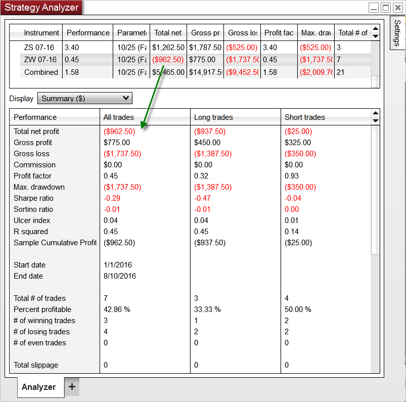



Reviewing Performance Results

|  |  |
| --- | --- |
| << [Click to Display Table of Contents](.\reviewing_performance_results.htm) >>  **Navigation:**  [Operations](operations-1.htm) > [Strategy Analyzer](strategy_analyzer-1.htm) >  Reviewing Performance Results | [Previous page](backtest_logs-1.htm) [Return to chapter overview](strategy_analyzer-1.htm) [Next page](monte_carlo_simulation-1.htm) |

Strategy Analyzer generates performance data that can be viewed in [Performance Displays](performance_displays-1.htm). When working with Optimizations or basket tests you can choose open an individual tab or new Strategy Analyzer window to analyze each individual backtest.  Selecting an individual row from the results grid will display the results in the Performance tabs individual [performance results](reviewing_performance_results-1.htm).

|  |
| --- |
| Notes:  •When viewing combined backtest or optimization results, many of the values shown are a weighted average based on the total number of trades.  This is used to provide a more accurate representation of combined trade performance.  Please see the page on [Basket testing multiple instruments](basket_test-1.htm) for more information.  •Strategy performance statistics can be found under the [Trade Performance Statistics Definition](statistics_definitions-1.htm) Page |

