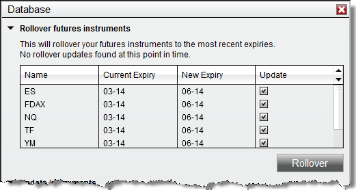



Operations \> Instruments \> Rolling Over Futures Contracts

Rolling Over Futures Contracts

| \<\< [Click to Display Table of Contents](rolling_over_a_futures_contrac.md) \>\> **Navigation:**     [Operations](operations-1.md) \> [Instruments](instruments-1.md) \> Rolling Over Futures Contracts | [Previous page](editing_instruments-1.md) [Return to chapter overview](instruments-1.md) [Next page](adding_splits_and_dividends-1.md) |
| --- | --- |

## Batch Rollover

NinjaTrader allows batch rollover of the contract expiry of all instruments across all instrument lists and windows on all open workspaces. To perform this batch rollover please see the steps below.

 

1\.Select the Tools menu within the Control Center followed by the Database Management menu item.

2\.The grid for the Rollover futures instruments section will show each instrument that is eligible to be rolled over. A contract is eligible to be rolled when today's date is greater then or equal to the rollover date defined for the instruments next contract month.

3\.When selecting "Rollover" any instrument with a check mark in the Update column will be updated to the contract month in the New Expiry column. 

 

Note: Rolling over futures instruments will update the expiry of the instruments across all instrument lists and windows using the instruments on all open workspaces. These changes on workspaces will need to be saved should you wish to preserve them. If there are areas you still wish to use the old expiry with please be sure to switch them back to the old expiry or do not rollover at this time. 

 

Note: NinjaScript strategies are not rolled forward and must be manually rolled over. 

 

 

## Manual Rollover

You can choose to manually rollover each window to the next contract month. This may be useful for when you want to only partially roll over your workspace.

 

Manually rolling the contract is done by typing in the next contract expiry in the windows instrument selector.For example: "ES 09\-16" to "ES 12\-16".

 

## Rollover of Drawing Objects

To rollover your drawing objects you can complete either a batch rollover or a manual rollover. Closing your chart and opening a new chart would result in the drawing objects being lost.

 

When rolling over, your drawing objects will be kept at the same price level they were originally placed. If a Merge Policy of MergeBackAdjusted is being used, this will result in the adjusted bars moving the price away from the original placement of the drawing objects. Using a Merge Policy of MergeNonBackAdjusted will keep the previous contracts prices the same, keeping the drawing object's placement with the bars. 

 

If you have a strategy that places drawing objects, the drawing objects will be redrawn when rolling over based on the bar's placement after rollover.

 

For more information on merge policies, see the [Merge Policy](merge_policy-1.md) section of this guide.

