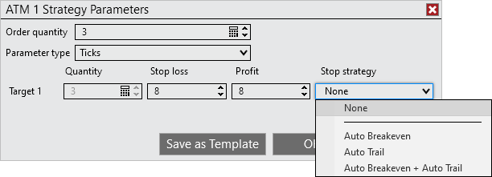

Operations \> Advanced Trade Management (ATM) \> Server Side ATMs \> Server Side Stop Strategy

Server Side Stop Strategy

| \<\< [Click to Display Table of Contents](server-side-stop-strategy.md) \>\> **Navigation:**     [Operations](operations-1.md) \> [Advanced Trade Management (ATM)](advanced_trade_management_atm-1.md) \> [Server Side ATMs](server-side-atm-strategy-1.md) \> Server Side Stop Strategy | [Previous page](server-side-atm-strategy-1.md) [Return to chapter overview](server-side-atm-strategy-1.md) [Next page](manage-server-side-atm-templat-1.md) |
| --- | --- |

[Show/Hide Hidden Text](javascript:HMToggleExpandAll(!HMAnyToggleOpen()) "Click to open/close expanding sections")

## ATM Stop Strategies

## ATM Stop Strategies provide additional functionality for the stop losses placed by an ATM Strategy, including Auto Breakeven, Auto Trail, or using both with Auto Breakeven \+ Auto Trail

 

A Stop Strategy is an extension of an ATM Strategy. It allows you to combineAuto Breakeven, Auto Trail, or using both with Auto Breakeven \+ Auto Trail for the management and automatic adjustment of your Stop Loss orders.

 

When setting up an ATM Strategy, you can select either None, Auto Breakeven, Auto Trail, or Auto Breakeven \+ Auto Trail before entering a position as part of a stop strategy.

 

 

When selecting Auto Breakeven, Auto Trail, or Auto Breakeven \+ Auto Trail the related Stop Strategy Dialog window will appear.

 

        [Understanding the Server Side Auto Breakeven parameters](javascript:HMToggle('toggle','UnderstandingTheServerSideAutoBreakevenParameters','UnderstandingTheServerSideAutoBreakevenParameters_ICON'))

| The Auto Breakeven feature will adjust your Stop Loss order to breakeven (average entry price for the ATM Strategy position) once a user defined Profit Trigger has been reached.   Auto Breakeven Parameters   | Profit Trigger | Sets the amount of profit required to move the Stop Loss to a breakeven value | | --- | --- | | Plus | Sets the amount added to the breakeven (average entry price for the ATM Strategy position) value |      Auto Breakeven Example   ServerSideATM_6   •Profit Trigger \- 10 ticks•Plus \- 2 ticks  Average Entry \- 10200 Short (DOW Emini contract) As soon as the market trades at 10190 (Average Entry \- Profit Trigger \= 10200 \- 10 ticks \= 10190\) NinjaTrader will move the Stop Loss order to 10,198 (Average Entry \- Plus \= 10200 \- 2 ticks \= 10198\) and enter a log event in the Log tab. |
| --- | --- | --- | --- | --- |

 

 

        [Understanding the server side Auto Trail parameters](javascript:HMToggle('toggle','UnderstandingTheServerSideAutoTrailParameters','UnderstandingTheServerSideAutoTrailParameters_ICON'))

| Auto Trail is a powerful stop strategy that allows you to be more liberal with your Stop Loss at the early stage of your trade and tighten your Stop Loss as your profits in your trade increase.   Auto Trail Parameters   | Stop Loss | Sets the value of the Stop Loss order as an offset behind the Profit Trigger/Frequency | | --- | --- | | Profit Trigger | Sets the amount of profit required to trigger the initial Stop Loss adjustment for the step | | Frequency | Sets the value of how frequent the Stop Loss order is adjusted after the Profit Trigger |      Auto Trail Example:   ServerSideATM_7   •Stop loss \- 6 ticks•Profit Trigger \- 4 ticks•Frequency \- 2 ticks  Your Stop loss will move 6 ticks behind the current price... ... after the price has moved 4 ticks in your favor... ... and your Stop loss will continue to trail 6 ticks behind the current price with ever additional 2 ticks in your favor.   Average Entry \- 1000 Long (SP Emini contract) The market moves up to 1001 and the Auto Trail is triggered (Average Entry \+ Profit Trigger \= 1000 \+ 4 ticks \= 1001\) and the Stop Loss is adjusted to 999\.50 (1001 \- Stop Loss \= 1001 \- 6 ticks \= 999\.50\). For every additional 2 ticks (Frequency of 2 ticks) the Stop Loss will be adjusted by 2 ticks. |
| --- | --- | --- | --- | --- | --- | --- |

 

 

        [Understanding the server side Auto Breakeven \+ Auto Trail parameters](javascript:HMToggle('toggle','UnderstandingTheServerSideAutoBreakevenPlusAutoTrailParameters','UnderstandingTheServerSideAutoBreakevenPlusAutoTrailParameters_ICON'))

| Auto Trail is a powerful stop strategy that allows you to be more liberal with your Stop Loss at the early stage of your trade and tighten your Stop Loss as your profits in your trade increase.   Auto Breakeven Parameters   | Profit Trigger | Sets the amount of profit required to move the Stop Loss to a breakeven value | | --- | --- | | Plus | Sets the amount added to the breakeven (average entry price for the ATM Strategy position) value |      Auto Trail Parameters   | Stop Loss | Sets the value of the Stop Loss order as an offset behind the Profit Trigger/Frequency | | --- | --- | | Profit Trigger | Sets the amount of profit required to trigger the initial Stop Loss adjustment for the step | | Frequency | Sets the value of how frequent the Stop Loss order is adjusted after the Profit Trigger |      Auto Breakeven \+ Auto Trail Example:   ServerSideATM_8     Auto Breakeven •Profit Trigger \- 10 ticks•Plus \- 2 ticks  Auto Trail •Profit Trigger \- 4 ticks•Frequency \- 2 ticks  Average Entry \- 1000 Long (SP Emini contract) The market moves up to 1002\.50 and the Auto Breakeven Profit Trigger is activated (Average Entry \+ Auto Breakeven Profit Trigger \= 1000 \+ 4 ticks \= 1002\.50\) and the Auto Breakeven Plus adjusts the Stop Loss to 1000 (Average Entry \+ Auto Breakeven Plus \= 1000 \+ 0  \= 1000\). Next, the market moved up to 1003\.75 and the Auto Trail Profit Trigger is activated (Average Entry \+ Auto Trail Profit Trigger \= 1000 \+ 15 ticks \= 1003\.75\) and the Stop loss is adjusted to 1002\.50 (1003\.75 \- Stop loss \= 1003\.75 \- 5 ticks \= 1002\.50\). For every additional tick (Frequency of 1\) the Stop loss will be adjusted by 1 tick. |
| --- | --- | --- | --- | --- | --- | --- | --- | --- | --- | --- |

