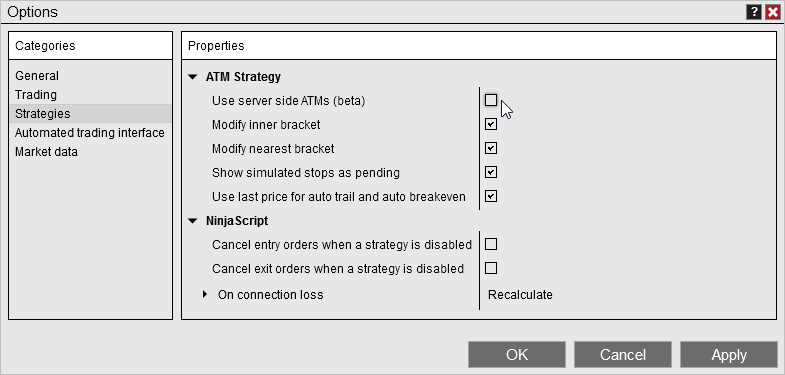



Operations \> Advanced Trade Management (ATM) \> Server Side vs Local ATMs

Server Side vs Local ATMs

| \<\< [Click to Display Table of Contents](server-side-vs-local-atms.md) \>\> **Navigation:**     [Operations](operations.md) \> [Advanced Trade Management (ATM)](advanced_trade_management_atm.md) \> Server Side vs Local ATMs | [Previous page](advanced_trade_management_atm.md) [Return to chapter overview](advanced_trade_management_atm.md) [Next page](atm_strategy.md) |
| --- | --- |

[Show/Hide Hidden Text](javascript:HMToggleExpandAll(!HMAnyToggleOpen()) "Click to open/close expanding sections")

Server side ATMs are the newly implemented feature, exclusive to the NinjaTrader connection. They simplify the local ATMs, while still including many of the primary features. Server side ATMs are currently in beta and will continue to be developed on to add additional functionality. However, there are some differences between server side ATMs and local ATMs that you must be aware of to ensure your orders function as expected.

Server side ATMs can be enabled/disabled under Tools\> Options\> Strategies\> ATM Strategies

 

 

| Warnings:  It is recommended to exit all ATM orders before switching between server side and local ATMs.   If Multi\-provider mode is enabled, server side ATMs will be disabled |
| --- |

 

| Server Side ATM Server side ATMs function independently of one and another. There is no active ATM strategy to select to scale in/out of. Every entry you make will place it's stops and profit in relation to your entry order. Example: If you entered long 1 contract on the ES at 3976\.50 with a stop loss and profit of 10, your stop loss would be placed at 3974\.00 and your profit would be placed at 3979\.00\. If you then scaled in 1 contract with your ATM at 3976\.00 a new stop loss would be placed at 3973\.50 and a new profit would be placed at 3979\.00   ServerVLocalATM1   The same would be true if you were to enter long 1 contract with your ATM and then enter short 1 contract with your ATM. In this scenario you would be flat, but your stop losses and profits would still be running. You would want to click Close to exit your position and cancel the the stop loss/profit. Example:  If you entered long 1 contract on the ES at 3976\.50 with a stop loss and profit of 10, your stop loss would be placed at 3974\.00 and your profit would be placed at 3979\.00\. If you then entered short 1 contract with your ATM a new stop loss would be entered at 3978\.25 and a new profit would be placed at 3973\.25, but you would be flat.     ServerVLocalATM2   Local ATM With local ATMs there is an active ATM which you can choose to scale in/out of. There is a property called ATM Strategy Selection Mod, which defaults if the active ATM should be selected or not. The Keep selected ATM strategy template on order submission selection functions similar to server side ATMs. However, the default that many people are familiar with works differently. The default is Select active ATM strategy on order submission. There is also a Display selected TM strategy only mode. For more information on all these modes, see the [ATM Strategy Selection Mode](atm_strategy_selection_mode.md) section of the help guide. However, for this example we will focus on the default setting. By default, after entering into a position with an ATM your active ATM will be selected. As you scale in/out, that will then add/subtract to the nearest stop loss/profit of your ATM. Example: If you entered long 1 contract on the ES at 3976\.50 with a stop loss and profit of 10, your stop loss would be placed at 3974\.00 and your profit would be placed at 3979\.00\. If you then scaled in 1 contract with your ATM at 3976\.00 your existing stop loss and target would get stacked with an additional order at the same price.   ServerVLocalATM3   The same would be true if you were to enter long 1 contract with your ATM and then enter short 1 contract with your ATM. In this scenario you would be flat, but the scaling out of the ATM would also remove the stop loss and target.   ServerVLocalATM4 |
| --- |

        [Selecting Rev On an ATM Position](javascript:HMToggle('toggle','SelectingRevOnanATMPosition','SelectingRevOnanATMPosition_ICON'))

| Server Side ATM With server server side ATMs clicking Rev while in an ATM will exit your position, cancel your orders, and enter your into a position on the other side of the market without an ATM strategy. Example: Enter long 1 contract with an ATM, press Rev. Now you are short 1 contract without a protected stop loss and profit. ServerVLocalATM5   Local ATM With local ATMs clicking Rev while in an ATM will exit your position, cancel your orders, and enter your into a position on the other side of the market with an ATM strategy. Example: Enter long 1 contract with an ATM, press Rev. Now you are short 1 contract with a protected stop loss and profit. ServerVLocalATM6 |
| --- |

        [Manually canceling a stop/target](javascript:HMToggle('toggle','Manuallycancelingastoptarget','Manuallycancelingastoptarget_ICON'))

| Server Side ATMs When canceling a stop loss or profit of a server side ATM the other order will stay active until it is also manually canceled or filled. However, if a stop loss or profit is filled, the other order will be canceled.   Local ATMs When canceling a stop or target of a local ATM the bracket of the order will also be canceled. Additionally, if a stop loss or profit is filled, the other order will be canceled. |
| --- |

        [Visibility and modification of stop losses/profits of ATM entry orders](javascript:HMToggle('toggle','VisibilityandmodificationofstoplossesprofitsofATMentryorders','VisibilityandmodificationofstoplossesprofitsofATMentryorders_ICON'))

| Server Side ATMs When placing an entry order with a server side ATM, the stop loss and target will show also. They will be in a suspended state, indicating they will not be working until they are triggered by the entry order filling. You can identify them as suspended order by the \+ next to the order quantity. The prices of these orders can be modified before the entry is filled.   ServerVLocalATM7   Local ATMs When placing an entry order with a local ATM, the stop loss and profit will not show. They cannot be modified before the entry is filled.   ServerVLocalATM8 |
| --- |

        [Parameter Type functionality](javascript:HMToggle('toggle','ParameterTypefunctionality','ParameterTypefunctionality_ICON'))

| Server Side ATMs There are 3 Parameter type selection for server side ATMs. They will all function the same, but just display the values in the specified format.     | Ticks | Ticks away from the average entry. | | --- | --- | | Delta Price | Price away from the average entry, based on the displayed price of the instrument. AKA Points away from the average entry. | | $ Value | Cash value away from the average entry, based on to Tick value of the instrument. |      ServerVLocalATM9   Local ATMs There are 5 Parameter type selections for local ATMs. Each functions differently than the other.     | Currency | PnL away from average entry. Calculated by the dollar per tick value for the order quantity used. | | --- | --- | | Percent | Percentage away from the average entry, based on the average entry price. | | Pips | Pips away from average entry. | | Price | The absolute price point specified. | | Ticks | Ticks away from entry average entry. |      ServerVLocalATM10 |
| --- | --- | --- | --- | --- | --- | --- | --- | --- | --- | --- | --- | --- | --- | --- | --- | --- |

        [Miscellaneous differences](javascript:HMToggle('toggle','Miscellaneousdifferences','Miscellaneousdifferences_ICON'))

| | Server side ATMs | Local ATMs | | --- | --- | | Can't be used with local orders (simulated and MIT orders) | Can be used with local orders (simulated and MIT orders) | | Templates are saved to the server, for use on any system you connect to | Templates are saved to your local computer and are only available where saved | | Templates are specific to the instrument | Templates can be used on any instrument | | Order quantity and TIF are not part of the template | Order quantity and TIF are part of the template | | Can be set up to have only a stop loss or only a profit | Can be set up to have just a stop loss. Cannot be set up to have just a profit. | | Can't place OCO order with ATMs attached | Can place OCO orders with ATMs attached | | Can't be used with NinjaScript | Can be used with NinjaScript | | Can't add ATMs to an unprotected position | Can add ATMs to an unprotected position | | No section called More with additional features | Includes a section called More with additional features | | No simulated stop volume trigger feature | Includes simulated stop volume trigger feature | | One step Auto Trail | Three step Auto Trail | | Can't enable/disabled stop strategy on a working ATM | Can enable/disable stop strategy on a working ATM | | No configurable settings under Options\> Strategies\> ATM Strategies | Configurable settings under Options\> Strategies\> ATM Strategies | | Can't be used with Playback | Can be used with Playback | |
| --- | --- | --- | --- | --- | --- | --- | --- | --- | --- | --- | --- | --- | --- | --- | --- | --- | --- | --- | --- | --- | --- | --- | --- | --- | --- | --- | --- | --- | --- | --- |

 

 

 

 

 

 

