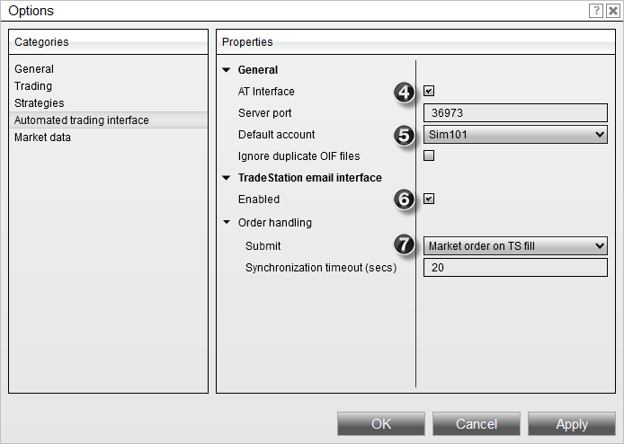
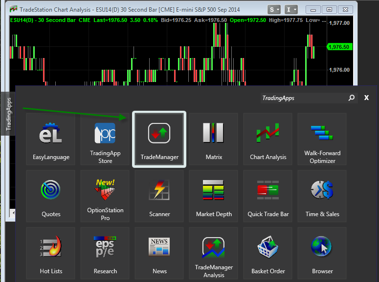
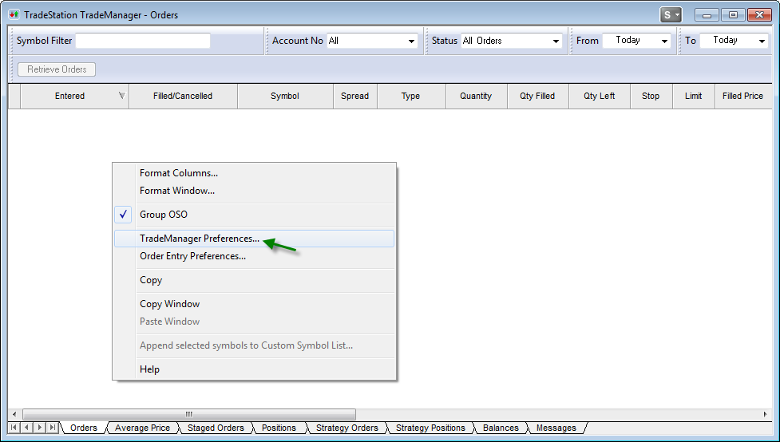
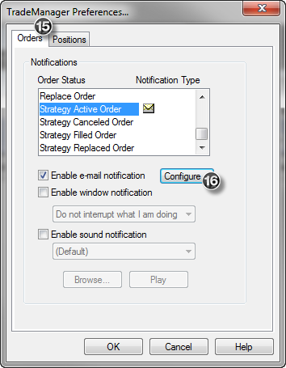
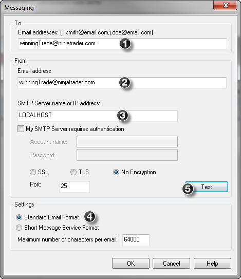
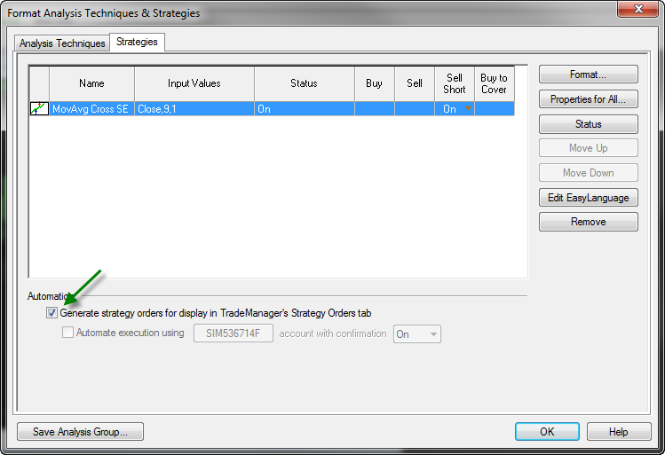



Operations \> Automated Trading \> Automated Trading Interface (ATI) \> TradeStation Email Integration \> Set Up

Set Up

| \<\< [Click to Display Table of Contents](set_up.md) \>\> **Navigation:**     [Operations](operations.md) \> [Automated Trading](automated_trading.md) \> [Automated Trading Interface (ATI)](automated_trading_interface_at.md) \> [TradeStation Email Integration](tradestation_email_integration.md) \> Set Up | [Previous page](running_concurrent_strategies_.md) [Return to chapter overview](tradestation_email_integration.md) [Next page](symbol_mapping.md) |
| --- | --- |

The following set up is for TradeStation Version 9\.XX.  This section will walk you through the set up in both NinjaTrader and TradeStation as well as allow you to send a test email through the Email Interface you have created.

 

## Setting up NinjaTrader

1\.Start NinjaTrader

2\.Select the Tools menu and then the menu item Options from the Control Center window

3\.Once in the Options window select the Automated trading interface category

 

 

4\.Ensure that AT Interface has been checked

5\.Set the default account to Sim101 (you can always set this to your live brokerage account later but we recommend leaving it to Sim101\)

6\.Check the "Enabled" option under the TradeStation email interface category

7\.Set your [Order Handling](order_handling_options.md) options

8\.Connect to your broker by selecting the File menu and then the menu item Connect within the Control Center window (make sure you have set up a [connection to your broker](%3C%25CONNECTIONGUIDE%25%3E))

 

 

| Note: If upon restarting the SMTP server does not initialize, go to Tools \-\-\> Options and click OK |
| --- |

## 

 

## Symbol Mapping for Futures Contracts (Stocks and Forex traders may skip this step)

9\.Set your [symbol mapping](tradestation_symbol_mapping.md) for futures contracts

 

## Setting Up Antivirus Software

10\. Antivirus software which scans outgoing emailing can impair the link between TradeStation and NinjaTrader. If your PC has Antivirus software installed and scans outgoing mail, each mail notification sent from TradeStation to NinjaTrader will be scanned and therefore add significant delay in automatically processing your trading signals. Please consult your Antivirus software Help Guide to determine how to disable the scanning of outgoing email.

 

## Setting Up TradeStation Workspace

11\. Start TradeStation

12\. Set up your [workspace options](workspace_options.md)

 

## Setting Up TradeStation Email Notification

13\. Add a TradeManager window to your workspace by clicking on the TradingApps panel on left pane as per the image below.

 

 

14\. Once the TradeManager window appears, right click on this window, and then select the menu name TradeManager preferences

 

 

15\. Select the "Orders" tab as per the image below and then select "Strategy Active Order"

 

 

16\. Press the "Configure..." button to bring up the "Messaging" window 

 

 

17\. Enter the information exactly as shown above in items 1 through 4; you can press the "Test" button which will send a test message to NinjaTrader and show up in the Control Center Log tab. If you receive an error when attempting to send a test message, please ensure that you have no other SMTP server running on your PC and make sure that any competitive products are uninstalled.

18\. Press "OK"

19\. Repeat steps 15 through 17 for "Strategy Canceled Order", "Strategy Filled Order" and "Strategy Replaced Order"

 

## Setting Up a TradeStation Strategy

20\. Open a chart(s) of the instrument that you will run your strategy on

21\. Right click in the chart and select the menu name "Insert Strategy..." and select a strategy

 

 

22\. Your strategy will appear in the "Format Analysis Techniques \& Strategies" window as shown above

23\. Check the "Generate strategy orders for display in TradeManager's Strategy Orders tab" box and press "Close"

 

| Note: Following this set up procedure, orders will NOT be sent to any live TS brokerage account, only to NinjaTrader. |
| --- |

 

That's it! Your strategy will now be automated for execution through NinjaTrader!

