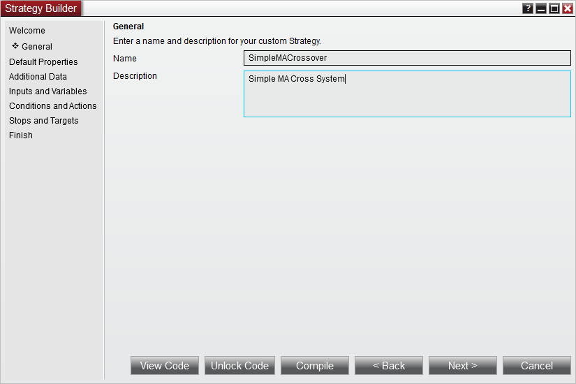
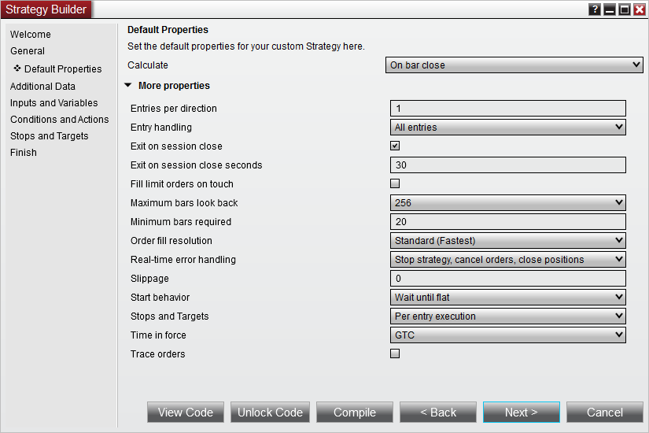
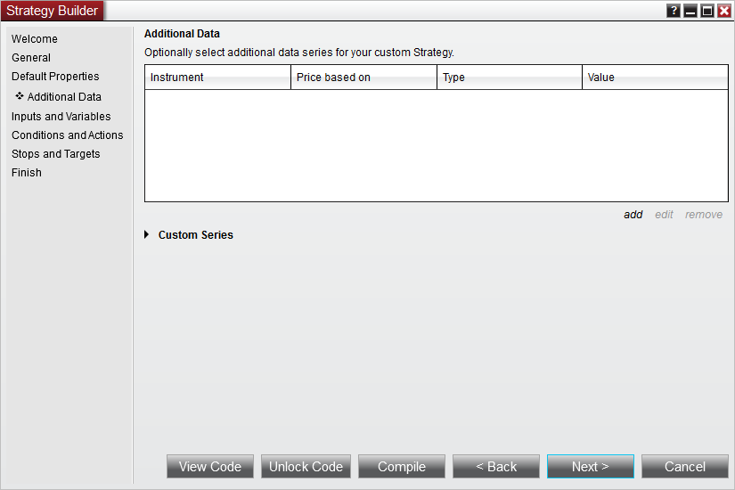
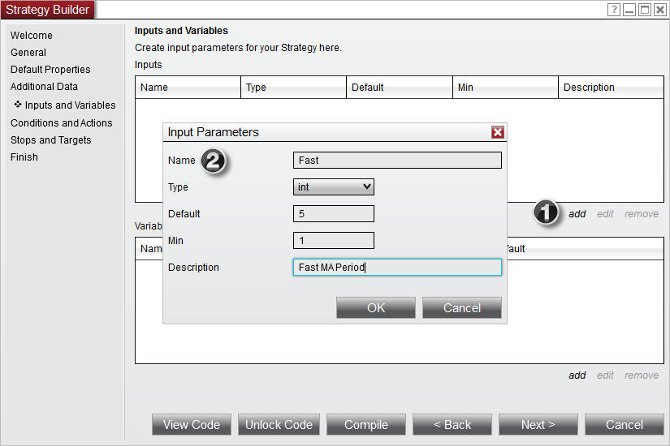
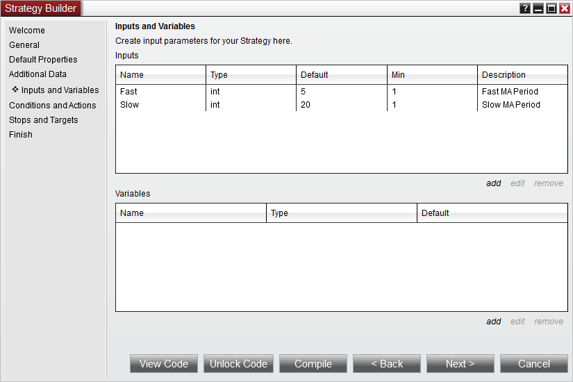
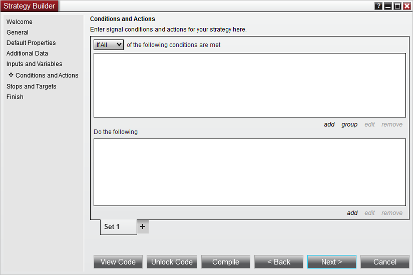



NinjaScript \> Educational Resources \> Developing Strategies \> Beginner \- Simple MA Cross Over \> Set Up

Set Up

| \<\< [Click to Display Table of Contents](set_up10.md) \>\> **Navigation:**     [NinjaScript](ninjascript-1.md) \> [Educational Resources](educational_resources-1.md) \> [Developing Strategies](developing_strategies-1.md) \> [Beginner \- Simple MA Cross Over](beginner_-_simple_ma_cross_ove-1.md) \> Set Up | [Previous page](beginner_-_simple_ma_cross_ove-1.md) [Return to chapter overview](beginner_-_simple_ma_cross_ove-1.md) [Next page](creating_the_strategy_via_the_-1.md) |
| --- | --- |

The first step in creating a custom strategy is to use the custom [Strategy Builder](strategy_builder-1.md). The builder provides two options:

 

•Allow you to create a functional strategy without any programming

•Generate the required NinjaScript code that will serve as the foundation for your custom strategy for further coding 

 

1\. Within the NinjaTrader Control Center window select the  New Strategy Builder... menu

2\. Press the "Next \>" button

 

 

3\. Enter the information as shown above

4\. Press the "Next \>" button

 

## Setting Default Properties

The next page will allow you to set defaults for basic properties related to your strategy, including it's [Calculate](calculate-1.md) and [EntryHandling](entryhandling-1.md) settings. Click the More Properties button to expose additional properties. For this tutorial, we will not change any basic properties' defaults, and instead will leave them all set to the values shown below:

 

 

## Adding Additional Data

The next page will allow you to configure one or more additional [Bars](bars-1.md) objects for use by the strategy. For our purposes, we will leave this page blank and move forward by clicking the Next \> button.

 

## 

## Defining Input Parameters

Below you will define your strategy's input parameters. These are any input parameters that can be changed by the user when running or backtesting a strategy. If your strategy does not require any parameters leave the "Name" fields blank.

 

1\.Click the add button to add a property

2\.Add input parameters into the newly created Input Parameters window and click Ok once the input parameter is set up

 

 

5\. Add the inputs as per the image above   

6\. Press the "Next \>" button

 

## Defining Conditions and Actions

Below you can define conditions that trigger user defined actions such as placing orders, drawing on a chart or creating an alert.

 

Notice how there are two buttons on the screen below:

 

View Code... \- Pressing this button loads the strategy code in the NinjaScript Editor for viewing purposes only. This is a great approach if you are new to programming or you want to see how the strategy wizard dynamically generates the correct script code on the fly.

 

Unlock Code \- Pressing this button loads the strategy code in the NinjaScript editor for further manual editing. Once this button is pressed, you can NOT go back to the Wizard for strategy construction and editing.

 

 

If you want to proceed with this tutorial through [self programming continue here](creating_the_strategy_via_self-1.md) after pressing the "Unlock Code" button.

If you want to proceed with this tutorial through [using the Strategy Builder please click here](creating_the_strategy_via_the_-1.md).

