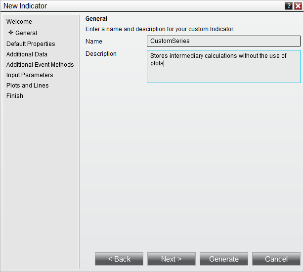
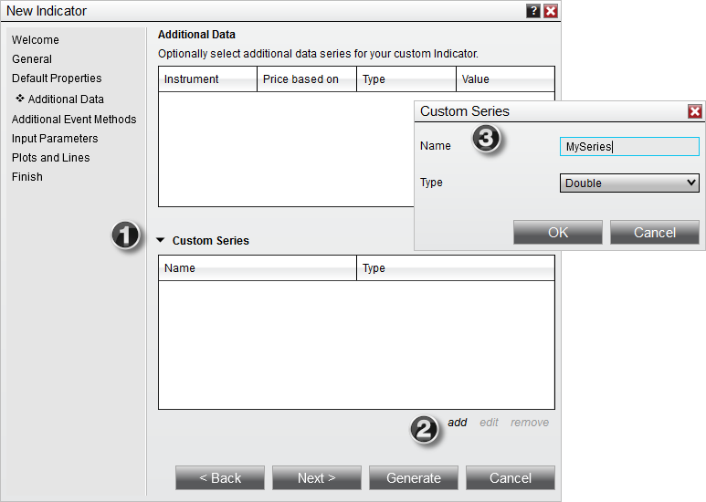
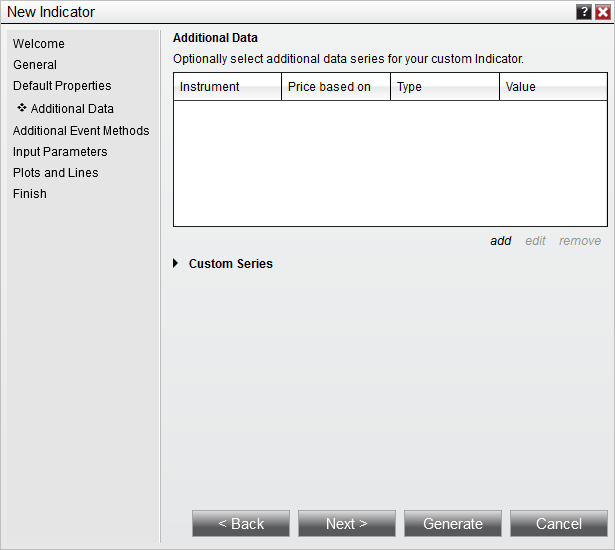
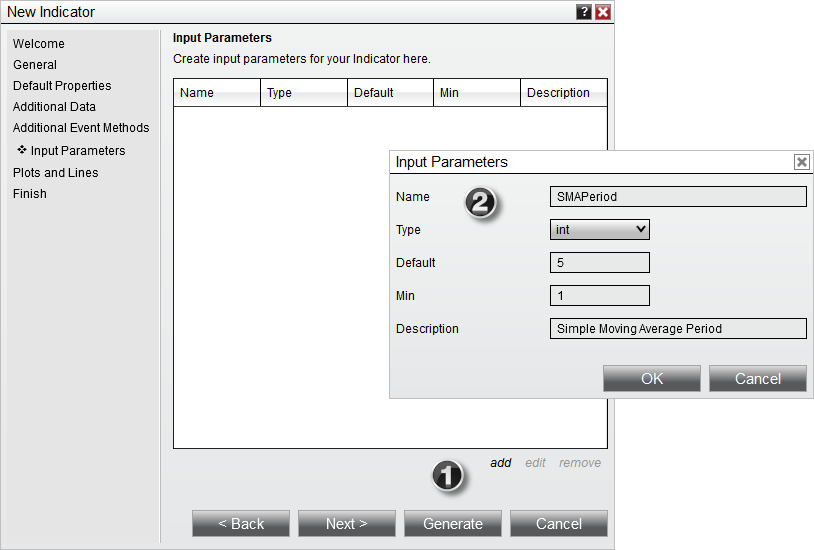
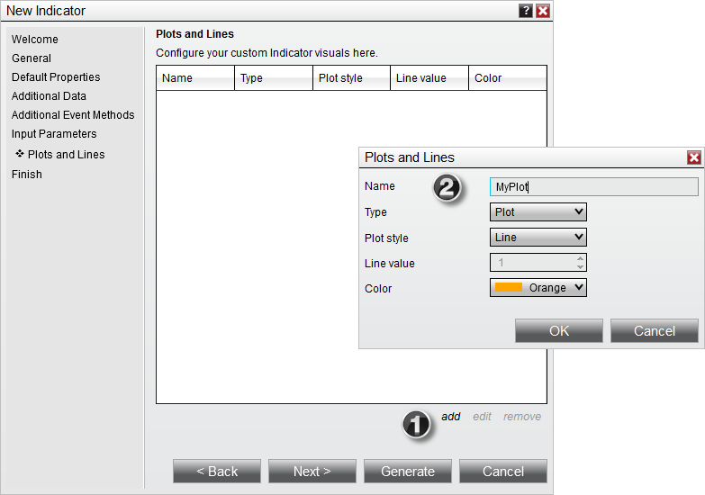


NinjaScript \> Educational Resources \> Developing Indicators \> Intermediate \- Historical Custom Data Series \> Set Up

Set Up

| \<\< [Click to Display Table of Contents](set_up7.md) \>\> **Navigation:**     [NinjaScript](ninjascript.md) \> [Educational Resources](educational_resources.md) \> [Developing Indicators](developing_indicators.md) \> [Intermediate \- Historical Custom Data Series](intermediate_-_historical_cust.md) \> Set Up | [Previous page](intermediate_-_historical_cust.md) [Return to chapter overview](intermediate_-_historical_cust.md) [Next page](entering_calculation_logic4.md) |
| --- | --- |
The first step in creating a custom indicator is to use the custom indicator wizard. The wizard will generate the required NinjaScript code that will serve as the foundation for your custom indicator.
 
1\. Within the NinjaTrader [Control Center](control_center.md), select the New menu, then select the NinjaScript Editor menu item.
2\. Right mouse click the "Indicators" folder in the NinjaScript Explorer section, then select the New Indicator menu item to open the New Indicator Wizard.
 
Defining Indicator Properties and Name  

First you will define your indicator's name and several indicator properties. Begin by clicking the Next \> button on the first page of the wizard to view the page shown below.
 

 
3\. Enter the information as shown above
4\. Click the Next \> button
 
## Setting Default Properties
The next page will allow you to set defaults for basic properties related to your indicator, including it's Calculate and Overlay settings. Click the More Properties button to expose additional properties. For this tutorial, we will not change any basic properties' defaults, and instead will leave them all set to the values shown below and move forward by clicking the Next \> button.:
 

## Adding Additional Data
The next page will allow you to configure one or more additional [Bars](bars.md) objects for use by the indicator. For our purposes, we will leave this page blank and move forward by clicking the Next \> button.
 

 
1\.Here we will click the arrow or the bold Custom Series text to be able to use the wizard to add our custom Series\<T\> object

2\.Once the menu is expanded, we can click the add button to add a Series\<T\>

3\.We will then enter the information above, and select Double as the variable type for the Series\<T\>

## Adding Event Methods
The next page will allow you to pre\-populate certain event methods into the NinjaScript code generated by the wizard. For our purposes, we will leave all of the checkboxes corresponding to different event methods unchecked, and will move on by clicking the Next \> button.
 

 
## Defining Input Parameters
The next page will allow us to configure user input parameters for the indicator. For our custom indicator, our eventual goal will be to create a simple plot that follows either above or below the bars based upon the Close price of a specified bar compared to the preceding bar. To allow for the variable selection of a number of bars ago, we will create one input parameter and call it "Periods." This variable will then be used to determine the number of bars used in the plot calculation.
 

 
1\. Clicking the add button on the "Input Parameters" page brings up the Input Parameters dialogue
2\. The Input Parameters dialogue can be used to define user inputs
 
We specify a default value of 10, which will refer to 10 bars in the calculation. We also specify a minimum value of 1 to ensure that we cannot enter a 0 or negative number for Periods.
 
## Defining Plots and lines
The next page will allow us to define plots and static lines for the indicator. For this indicator, we will define a single plot, called "MyPlot."
 

 
1\. Clicking the add button on the "Plots and Lines" page brings up the Plots and Lines dialogue
2\. The Plots and Lines dialogue can be used to define the plot
 
After this, click the Finish button, and the Indicator Wizard will generate a basic code structure implementing the parameters that you have set. You are now ready to move on to [entering calculation logic](entering_calculation_logic4.md) in your code.
