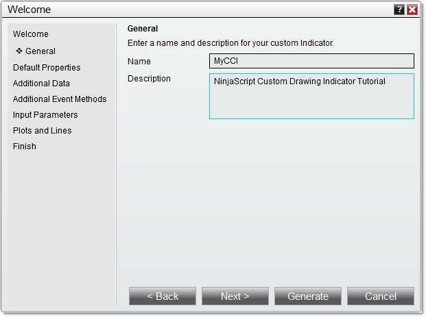
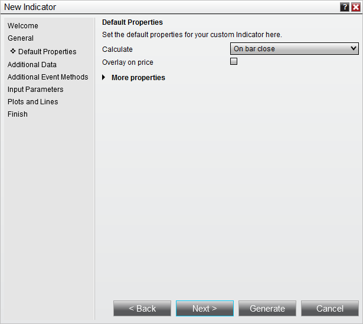
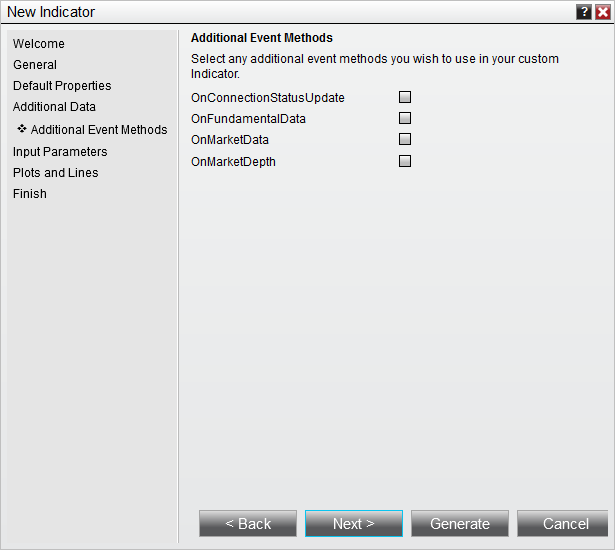
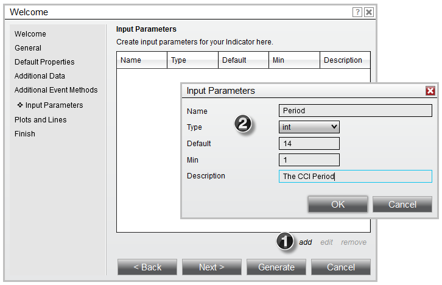
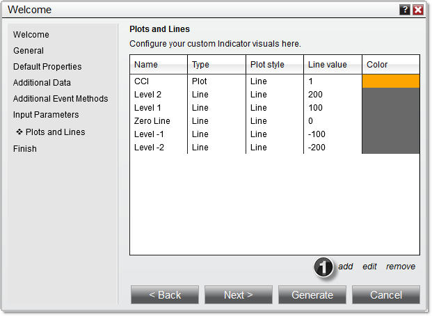


NinjaScript > Educational Resources > Developing Indicators > Advanced - Custom Drawing > Set Up

Set Up

| << [Click to Display Table of Contents](set_up9.md) >> **Navigation:**     [NinjaScript](ninjascript-1.md) > [Educational Resources](educational_resources-1.md) > [Developing Indicators](developing_indicators-1.md) > [Advanced - Custom Drawing](advanced_-_custom_drawing-1.md) > Set Up | [Previous page](advanced_-_custom_drawing-1.md) [Return to chapter overview](advanced_-_custom_drawing-1.md) [Next page](entering_calculation_logic6-1.md) |
| --- | --- |
The first step in creating a custom indicator is to use the custom indicator wizard. The wizard will generate the required NinjaScript code that will serve as the foundation for your custom indicator.
 
1. Within the NinjaTrader [Control Center](control_center-1.md), select the New menu, then select the NinjaScript Editor menu item.
2. Right mouse click the "Indicators" folder in the NinjaScript Explorer section, then select the New Indicator menu item to open the New Indicator Wizard.
 
Defining Indicator Properties and Name  

First you will define your indicator's name and several indicator properties. Begin by clicking the Next > button on the first page of the wizard to view the page shown below.
 

 
3. Enter the information as shown above
4. Click the Next > button
 
## Setting Default Properties
The next page will allow you to set defaults for basic properties related to your indicator, including it's Calculate and Overlay settings. Click the More Properties button to expose additional properties. For this tutorial, we will not change any basic properties' defaults, and instead will leave them all set to the values shown below:
 

 
## Adding Additional Data
The next page will allow you to configure one or more additional Bars objects for use by the indicator. For our purposes, we will leave this page blank and move forward by clicking the Next > button.
 

 
## Adding Event Methods
The next page will allow you to pre-populate certain event methods into the NinjaScript code generated by the wizard. For our purposes, we will leave all of the checkboxes corresponding to different event methods unchecked, and will move on by clicking the Next > button.
 

 
## Defining Input Parameters
The next page will allow us to configure user input parameters for the indicator. For our custom CCI indicator, we will create a single input parameter which can be changed by users in the Indicators window when applying or editing the indicator. This input parameter will determine the CCI's period. We will select int as the Type, since integers are the most efficient native data types to be used for positive whole numbers, like those used to specify a number of bars to look back (a period). We will enter a "Default" value of "14" for the period, and a "Min" value of 1, to ensure that users do not enter zero or lower.
 

 
1. Clicking the add button on the "Input Parameters" page brings up the Input Parameters dialogue
2. The Input Parameters dialogue can be used to define user inputs
 
## Defining Plots and lines
The next page will allow us to define plots and static lines for the indicator. For the CCI, we will define a single plot, called "CCI," and define five lines to draw in the indicator panel. For each item, first click the add button, then use the Plots and Lines dialogue to configure each item as seen below.
 

 
1. The add button will allow you to configure plots and lines for the indicator.
 
After this, click the Finish button, and the Indicator Wizard will generate a basic code structure implementing the parameters that you have set. You are now ready to move on to [entering calculation logic](entering_calculation_logic6-1.md) in your code.
