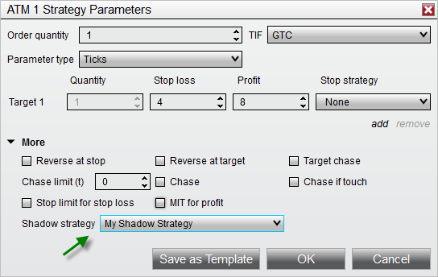



Operations \> Advanced Trade Management (ATM) \> ATM Strategy \> Advanced Options \> Shadow Strategy

Shadow Strategy

| \<\< [Click to Display Table of Contents](shadow_strategy.md) \>\> **Navigation:**     [Operations](operations-1.md) \> [Advanced Trade Management (ATM)](advanced_trade_management_atm-1.md) \> [ATM Strategy](atm_strategy-1.md) \> [Advanced Options](advanced_options-1.md) \> Shadow Strategy | [Previous page](auto_reverse-1.md) [Return to chapter overview](advanced_options-1.md) [Next page](faq-1.md) |
| --- | --- |

## What is a Shadow Strategy?

Initiating a Shadow Strategy is a method for forward testing alternate trade management ideas. As an example, you may have a method that is profitable, but you have some ideas on how to increase its profitability. Maybe hold on to a few contracts for a higher target? With a Shadow Strategy, you can set up an alternate ATM Strategy and link that to an ATM Strategy that will be used for live trading. Every time you enter a position using your live strategy, NinjaTrader opens a simulated position (e.g. Sim101 account) managed by your Shadow Strategy. This allows you to forward test your concepts using the same entry signals that trigger your live trades. Over time, a historical database of actual (live) and Shadow (simulated) Strategies are compiled. You can then compare the live trades to the shadow trades under the [Performance Tab](trade_performance-1.md). The end result is that you will be shown what ATM Strategy (over time) is more profitable. Changing your trade management logic without truly understanding the impact of the changes is a risky shot in the dark. Shadow Strategies give you the proof of concept needed to feel confident that your ATM Strategy changes make sense.

 

 

| Warning: Shadow strategies can only be used when Multi\-provider mode is enabled, so that orders can be submitted to the local simulation account. If Multi\-provider is disabled, that Shadow strategy will be set to Disabled and will not function. |
| --- |

 

| Tips •Intelligently name Shadow Strategies by including a prefix such as "Shadow \- My Strategy" •When using the Performance Tab, you can filter your reports to include or exclude your Shadow Strategy |
| --- |

